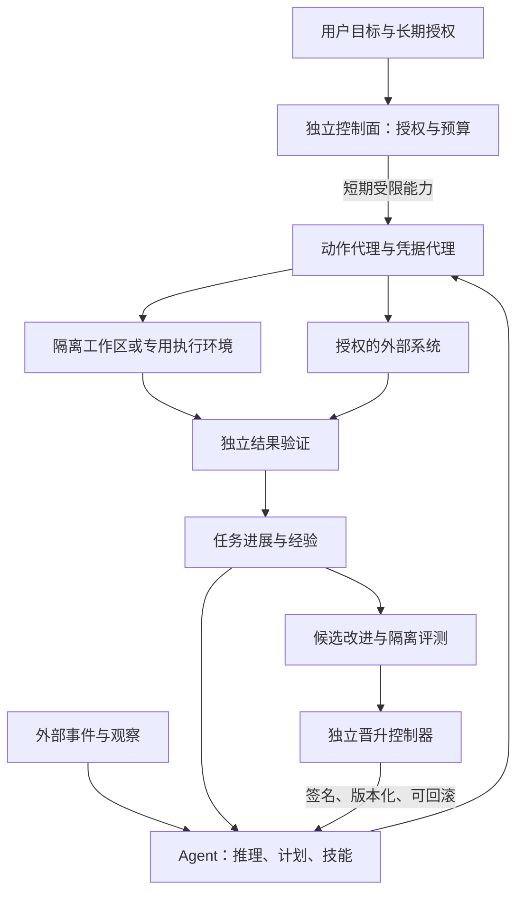

# 从可成长助理到高智能自治智能体：现状分析与路线

审计日期：2026-09-06。代码基线：`c60b41e`，根版本 `0.1.24`。本文是架构分析与建议，未修改运行代码或部署权限。源码与测试检查针对本仓库；没有读取用户实际 DSH profile、私人会话或生产凭据，所以不能把“仓库支持”写成“当前部署已经启用”。

## 结论

项目已有较完整的执行、消息、治理和有限成长基础设施。主要缺口集中在：跨任务的目标经营、按任务组织上下文、可验证的领域结果、策略学习与技能实验、业务范围内的持续主动决策，以及独立于执行体的高权限控制面。

应把目标定义为：**在用户给定的目标和授权范围内，持续选择有价值的下一步，完成并验证结果，从经验中产生可测量的能力增益，同时保持成本、外部影响和撤销能力受控。**

“高智商”不能由插件数量证明；模型本身、任务信息、工具质量和执行策略都会影响最终结果。当前未发现模型权重训练闭环。近期可实现的是知识、策略、技能和工具层的进化，不是承诺无上限的通用智能或递归自我提升。

## 已有能力，及其真实边界

| 层 | 已有实现 | 对目标仍不足的部分 |
| --- | --- | --- |
| 基础推理与执行 | 上游 DSH 已有 Agent loop、goal/plan/todo、subagent、workflow、skills、compaction；本仓库接入多种模型 route | 缺少本项目的任务级策略选择与增益评测；不能把接入更多模型当成已经更聪明 |
| 交互与连续运行 | Delivery inbox/outbox、owner binding、持久会话、重试、未知发送对账；Lark 常驻、进度与审批 | 会话/投递可靠，不自动意味着跨日目标持续推进与结果正确 |
| 主动性 | Automations 冷调度、租约、预算；Heartbeat 时段/scratch；file/HTTPS JSON/webhook 触发 | 主要根据已配置任务/信号运行，尚未形成统一的机会发现、优先级、预期价值和打扰成本决策层 |
| 记忆 | Memory 分域、来源、信任、TTL、审批、owner namespace；Wiki Markdown 真源；晋升与取消补偿 | 记忆召回主要为词法匹配；启动快照不按当前任务查询；尚缺结构化情境、矛盾推理和检索效用闭环 |
| 个性适应 | T1 固定偏好 catalog、证据积累、自动 overlay、曝光归因、纠正回滚 | 重点是语言、详略、结构等；不能推断为问题解决策略已得到学习 |
| 行为演化 | Evaluation 区分执行/目标/投递；Evolution 证据投影、analyst、owner 审批 guidance、退化回滚 | 自由文本新策略仍需审批；未证明同预算下复杂任务解决率持续提高 |
| 工作流学习 | 自动 producer、审批、paused artifact、replay/shadow/canary/promotion 状态机 | 自动 selector 只有两个摘要模板；质量检查薄弱；仍依赖显式成功反馈 |
| 能力工厂 | gap/ROI/catalog、activation plan、签名回执、本地 PR/review/merge/build/sign/publish/verify/admission | 本地参考链不等于生产远程发布与自动启用；真实 Host attestor 和长期运行还依赖部署侧 |
| 权限与恢复 | Policy 单调 deny、硬预算、紧急停止、自动 reviewer、凭据 lease、确定性 Recovery | 同宿主/同 UID 的任意代码不能仅靠 TypeScript 私有 capability、文件 mode 或 prompt 隔离 |

关键依据：

- [本仓库架构](architecture.md)、[兼容性基线](compatibility.md)、[插件目录](../plugins/README.md)。
- 上游能力经[固定提交的官方 base patch](https://github.com/deepseek-ai/deepseek-harness/blob/141eb6fef83422698aef7a981029e843e8161534/packages/bundle/base/cordis.patch.yml)核验；本仓库 [ACP preset](../plugins/acp/src/control.ts) 第 40–59 行也直接复用这些能力。因此不建议新造 Agent loop、goal/subagent/workflow runtime。
- [Memory search/snapshot](../plugins/personal-memory/src/store.ts) 第 649–742 行：词法命中加权，snapshot 使用空 query；[注入](../plugins/personal-memory/src/service.ts) 第 569–595 行按 Agent 缓存快照。模型仍可主动调用 memory search，问题是默认自动召回没有围绕任务组织。
- [Automation 定义](../plugins/assistant-automations/src/types.ts) 第 13–43 行围绕 schedule/prompt/model/tools/budget；[runner](../plugins/assistant-automations/src/runner.ts) 第 55–88 行将 completed/max-tokens 归为 execution succeeded。这个状态不是 objective achieved。
- [Heartbeat 配置](../plugins/assistant-heartbeat/src/config.ts)、[触发器配置](../plugins/event-triggers/src/config.ts)、[偏好 catalog](../plugins/preference-learning/src/catalog.ts)。
- [成长专项证据](agent-growth-gap-evidence-2026-09-06.md)进一步追踪生产接线、测试边界和正确性缺口。

安装层需要单独看：`personal-assistant` meta 只组合四核心，默认 scheduler 关闭；普通 Lark 安装包含 Preference；实际 `supervised` installer 包含 Evaluation、Evolution、Growth Experiments、Heartbeat、Health、Recovery。插件目录中 Growth“不进入默认成长配置”的文字与安装脚本已有出入，应以实际 installer 和有效 profile 为准。参见 [meta patch](../plugins/personal-assistant/cordis.patch.yml)、[installer](../scripts/install/common.sh)、[成长部署文档](../plugins/lark-channel/docs/supervised-growth.md)。

## 应优先修正的成长证据问题

### 1. Canary 使用旧 raw outcome，未遵循最新学习投影

[Automations service](../plugins/assistant-automations/src/service.ts) 第 1158–1176 行查询 raw trusted achieved 并调用 `getTrustedOutcome()`；第 1215–1241 行 promotion 使用已保存的 canary proof，没有重新读取最新任务学习版本。

而 [Evaluation store](../plugins/assistant-evaluation/src/store.ts) 第 974–1009 行的 query 是 append-only raw outcomes；第 1241–1288 行才处理 owner 冲突，将学习 disposition 改为 retract。已有成功之后的负向反馈可能使最新投影失效，却留下旧成功记录仍能被 canary 消费。动态复现状态见专项证据文档。

必须区分可达性：普通 Delivery 对同一任务的相反 `/feedback` 目前明确返回“本次未覆盖原记录”，并不产生一条新的冲突 outcome；因此不能把连续发送这两条命令当成上述 latest-projection 绕过的复现。这里另有产品能力缺口：用户缺少直接修订/撤销已记录任务评价的完整入口。应在增加该入口的同时，验证所有晋升消费者都会响应撤票；原始查询与晋升前缺少复验的风险仍属静态审计结论。

修复方向：复用 `getTrustedTaskLearningProjection()` 与 writer fence，把 canonical task revision、digest、scope watermark 绑定进 inspection/promotion。提交边界重新核验；已撤回、冲突或版本漂移时拒绝晋升。禁止另起一套互相不一致的“可信成功”定义。

### 2. Replay/shadow 尚不足以证明改进

[Automations service](../plugins/assistant-automations/src/service.ts) 第 1035–1065 行的 replay 检查 evidenceCount 并计算摘要，不重新执行历史任务；第 1068–1107 行的 shadow 有副作用拦截证明，但 passed 取决于 run succeeded。

应保留现有无副作用边界，另补：同输入的基线/候选执行、领域结果验证、盲评或确定性测试、成本和退化比较。结构完整性、无副作用、任务有效性是三个独立条件。

### 3. 自动学习覆盖面非常窄

[workflow-auto-producer](../plugins/assistant-delivery/src/workflow-auto-producer.ts) 的 catalog 只有每日/每周工作区摘要，六个精确表达；模板执行时间固定 UTC。真实自动链又依赖 owner 对已投递回复给出 `/feedback achieved`。这是一条可控纵向切片，尚不能覆盖普通复杂任务的流程归纳。

扩展时要增加 typed workflow 表达：输入、前置条件、步骤依赖、参数、工具能力、结果验证、失败补偿；抽取由模型负责，校验和授权由宿主负责。不能简单把任意聊天原文复制为定时 prompt。

## 智能方面最值得增加的六项能力

### A. 目标经营与任务策略

在 DSH 原生 goal 上增加跨会话的业务目标视图：目标、可观测成功条件、截止时间、优先级、依赖、授权引用、预算、当前假设、阻塞原因、下次唤醒条件和证据引用。保持 goal/session/run 的关联，避免三套状态分别宣称完成。

选择下一步前判断：现在最影响目标的未知是什么？该检索、实验、执行还是等待？失败是信息不足、方法不对、工具不可用还是目标已经变化？允许根据新证据重规划；不允许为完成率改写用户目标。

按难度自适应使用直接执行、先调查、独立复核、多个候选或子任务并行。复用上游 subagent，只有预期收益足以覆盖协调成本时才派发。模型 route 选择记录任务类型、延迟、失败率与真实成果，不能只按模型名字决定。

### B. 围绕当前任务组织上下文

把长期用户偏好、项目状态、任务过程、失败经验、可执行技能分别管理。每条有效经验至少带来源、时间、适用条件、置信度、反例与失效条件。

先改 task-aware retrieval，再按真实召回失败决定是否增加 embedding、混合检索和 reranker。检索要带 goal/step/query，返回可追溯证据及冲突项；上下文预算优先给决定下一步所需的信息。不要默认增加图数据库或塞入更多历史。

工具结果的压缩保留结论、关键原始证据、未解决问题与原文引用；跨日恢复先验证状态变化，再复用旧计划。测量“相关记忆有没有被找到”和“找到之后是否改善决策”，不能只测 search 返回非空。

### C. 独立结果验证与不确定性处理

按领域增加 verifier：代码用测试及行为复现，文档用引用/事实/完整性检查，任务管理用目标系统查询，消息用送达回执加内容/对象校验，GUI 用界面状态和业务结果。工具退出码只证明工具执行。

将环境事实、用户价值判断、模型自评分开保存；owner 的主观偏好可以主导效用，但不应抹掉“部署没有成功”等可观测事实。无法验证就保留 unknown，并选择低成本验证、等待或请求关键信息。

复杂决策可要求提出至少一个可区分假设的实验，但不必每次都运行多模型辩论。判断是否使用复核的标准应是它能否降低真实错误。

### D. 有选择的主动性

建立统一 event envelope：来源、事件时间、对象、版本、可信度、去重键、授权范围和敏感度。邮件、日历、代码库和任务系统优先复用 DSH MCP/现有连接器，通过薄适配器提供稳定事件和动作结果。

把事件关联到已有目标，再进行价值判断。可使用一个可校准的启发式：预期目标收益 × 成功概率 − 执行成本 − 打扰成本 − 可能损失；它是策略输入，不是精确概率证明，更不能越过硬权限。

允许三种主动动作：静默准备、有价值时提醒、在预授权范围直接执行。支持静默时段、事件合并、每目标成本、重复建议抑制、用户拒绝后的冷却与目标结束后的自动退订。持续运行也必须允许合理休眠。

### E. 从失败轨迹到技能和工具

可进化对象分成事实记忆、偏好、guidance、可执行 skill/workflow、工具实现。优先优化信息获取和执行策略，避免把同一种失败写成大量泛化口号。

候选需要说明：解决哪类已观察失败、适用前置条件、基线为何失败、改了什么、预期改善什么指标、可能伤害哪些旧能力、如何撤回。技能必须经过执行评测，并带输入/输出与验证器；模型文字自评只用于提出候选。

### F. 真实能力评测与长期观测

建立固定任务集和留出集，覆盖代码修复、资料研究、跨日工作、主动发现、干扰/注入、授权撤销、目标改变和重复外部操作。保存版本化模型、prompt、skill、工具、policy 与数据集标识。

采用固定模型/固定预算比较基线与增强版，再单独测换模型增益；分别关闭记忆、规划、复核、成长做消融，找出真正贡献。记录多次运行分布，避免一次运气好就晋升。

建议首批约 50 个实际个人任务用于开发与诊断，另留不参与候选生成的任务作为验收；数量是启动建议，置信度要求取决于任务差异和失败代价。

## 高权限和安全如何兼得

可以显著兼得，但需要明确威胁模型。应让 Agent 在业务授权范围拥有很高的行动自由，同时让授权根、凭据、评测和发布裁决处于它不能任意改写的执行域。对整台宿主永久 root 权限，又要求宿主上的软件策略绝不可绕过，两者无法由本仓库自己保证。

现有 [SECURITY](../SECURITY.md) 明确插件与宿主同权。[Policy](../plugins/assistant-policy/README.md) 明确 `workspace-write` 不等于网络/子进程隔离，`run_code` 不是 OS 安全边界；full 档绕过参数级即时风险门，仍保留通过 guard 的显式 deny/预算。这个 guard 对绕过工具管线的同权恶意代码不构成隔离证明。

建议架构：

实施要点：

1. **可预授权的能力包。** 固定资源范围、动作、收件人/域名、期限、次数、费用和可否转授权。长期授权覆盖常规动作，任务执行取得短期 lease，后台定期续验撤销状态。避免每条 shell 都问用户。
2. **执行面与控制面分进程，必要时分 UID/VM。** Agent 可在一次性开发环境自由安装、运行、改代码；不能写信任配置、评测结果、签名器或 supervisor。工具/第三方插件也纳入边界。敏感宿主资源经受限 broker 暴露，不靠“不会调用内部函数”。
3. **凭据留在 broker。** 现有 Keychain lease 是起点，但 callback 能拿到 secret，不能据此声称同宿主插件永远拿不到凭据。扩展为 broker 在授权目的地代签/代调用；模型和任意代码不持有通用生产 token。
4. **同时约束读取、执行和外发。** 单纯允许某域名不证明可发送任何私有内容；单纯允许 read 加 send 也可能组合成泄露。检查数据来源/敏感度、目标、payload、重定向及子进程出口，限制可组合副作用。
5. **把最终提交变成有边界动作。** 可自由准备的变更，在提交时绑定内容 digest、目标、版本前置条件、幂等键和当前授权。新增收件人、删除重要数据、扩大范围才升级审批；已获长期授权的正常业务不重复询问。
6. **外部停止与回滚。** 控制面停止新 lease、终止执行进程、撤销凭据与出网权限，保留不可由执行体覆写的审计。代码可回滚；已发送消息和已支付款项不能真正撤回，必须使用额度、延迟提交或业务补偿降低损失。

Agent 可以提出修改 policy/evaluator 的候选，并在隔离副本中评测；生产 trust root、硬上限、裁决器和隐藏验收集由外部所有者或受保护发布流程控制。安全机制自身可以演进，但不能让同一个待验证候选自行宣布它已经可信。

## 自主进化的完整流水线

观察失败与重复工作 → 归因并形成改进假设 → 创建不可变候选版本 → 隔离执行和留出评测 → 成本/收益与旧能力回归比较 → 在预授权范围自动晋升或请求范围扩展 → 小流量验证 → 持续观测 → 退化撤销。

需要补齐候选档案：父版本、代码/skill/prompt 摘要、训练用经验、评测集版本、独立结果、权限变化、成本和回滚目标。保留有解释价值的失败分支，但限制实验预算、生命周期和存储；不允许为了提升分数接触或改写隐藏答案。

自动晋升优先覆盖固定低风险偏好、已批准能力范围内的检索/格式/技能策略。新增外部副作用、提高费用上限、新安装高权限插件、改变信任边界走独立裁决。不能用累计成功次数把整个 Agent 升成永久无限权限。

## 分阶段实施计划

以下工期只是小团队的粗估，取决于现有部署、平台与 verifier 数量；按验收结果推进，不按日历自动扩权。

| 阶段 | 工作与仓库落点 | 建议验收门 |
| --- | --- | --- |
| P0：可信基线，约 1–2 周 | 修复 Canary canonical projection/fence；升级 replay/shadow 验证；对齐安装文档；在 `assistant-evaluation` 接入第一批领域 verifier | 冲突/撤回样本绝不晋升；区分执行/目标/送达；固定任务集得到可重复基线；现有 check 与新反例通过 |
| P1：自主完成任务，约 2–4 周 | 在原生 goal 上加业务目标编排插件；改进 Memory 任务召回；接通任务结果和重规划；复用 Delivery/Automations 恢复 | 多步骤真实任务能跨会话/重启恢复；无重复外部提交；同模型同预算比基线有稳定改善 |
| P2：高权限执行，约 2–4 周，可与 P1 并行 | 扩展 Policy 为授权 lease；凭据/动作 broker；隔离 worker；独立 audit/stop；优先完成一个生产平台 | worker 无法访问信任根和通用 token；所有实际副作用经过 broker；子进程/网络绕行、撤销竞态、进程崩溃反例被拦截 |
| P3：有价值的主动性，约 2–3 周 | 在 event-triggers/Heartbeat 上加事件到目标的关联和机会排序；先接代码/任务/日历中的两个来源 | 提醒被采纳率、漏掉可行动机会、每周打扰次数和主动收益均可测；至少运行两个完整工作周 |
| P4：自主策略与技能进化，约 3–6 周 | 扩展 Growth 的 typed workflow、真实基线对比和留出集；技能实验；沿 Control Plane 补所需生产 adapter | 相同预算下留出集表现改善，重要回归集不过线则不晋升；晋升后退化自动关闭对应版本；能重放完整证据链 |

包边界建议只新增确实独立的“业务目标编排”“执行代理”“能力实验”服务；先复用现有 `assistant-growth-experiments` 和 Control Plane，避免按术语拆十几个薄插件。共享纯契约放 `packages/*`，不自动激活；新增 bundle 遵守 generator、patch、README、catalog 和 pack 契约。

第一条产品纵向切片建议：用户一次授权维护一个仓库 → 接收 CI/issue 事件 → 关联目标并判断是否值得处理 → 隔离调查和修复 → 独立验证 → 在允许的分支创建 PR → 跟进 CI 和评审 → 保存有效修复策略 → 下次同类任务验证是否更快、更准。真实 PR/对外动作在该产品启用时按具体授权执行，本次分析没有替用户发起这些动作。

## 度量成功

核心指标是**每个成功且经过验证的目标所需成本与人工介入**，并单列自主性和边界失误，避免用一个总分掩盖严重错误。

| 指标 | 定义与防误用 |
| --- | --- |
| Verified completion | 独立 verifier 证明完成的目标 / 有验收条件的任务；unknown 单列 |
| Human intervention | 每成功目标的用户介入次数，区分授权、补充信息、纠错 |
| Cost per success | 包括失败、重试、评测、reviewer、实验在内的总成本 / verified successes |
| Long-horizon reliability | 指定时长、重启和事件变化下目标正确恢复的比例 |
| Proactive precision/recall | 用户认可的可行动主动建议 / 全部主动建议；独立标注机会中的覆盖率，不能通过永不提醒刷高分 |
| Memory utility | 相关证据召回、错误记忆使用、过期事实采用，以及对任务成功率的实际贡献 |
| Evolution gain | 固定模型与预算，在未参与候选生成的任务上，相对冻结基线的多次运行改善与置信区间 |
| Boundary failures | 未授权副作用、重复提交、secret 外泄、停止失败、证据失效后晋升；任何严重个案单独阻断发布 |

可先把“常规授权内任务免逐动作审批”“真实工作连续两周”“成本受限且留出集有增益”设为产品目标。不要宣称有限测试中的零越界等于绝对安全。

## 外部一手研究与本项目的对应关系

- Anthropic 的 [Effective harnesses for long-running agents](https://www.anthropic.com/engineering/effective-harnesses-for-long-running-agents)讨论跨会话状态、增量工作和完成验证。这里借鉴任务状态与证据交接，不照搬第二套执行框架。
- Anthropic 的 [Demystifying evals for AI agents](https://www.anthropic.com/engineering/demystifying-evals-for-ai-agents)区分能力评测和回归评测，并结合代码、模型及人工评分。这里对应“已有账本”到“有领域真值和能力增益实验”的差距。
- Sakana 的 [Darwin Gödel Machine](https://sakana.ai/dgm/)展示以编码评测筛选自修改候选，也报告伪造工具使用/测试日志的问题。它支持隔离实验与外部验证的方向，不证明本项目已经能获得相同增益或任意领域自我提升。
- Anthropic 的 [sandboxing 工程说明](https://www.anthropic.com/engineering/claude-code-sandboxing)以文件系统、网络隔离和代理凭据减少逐动作审批。本项目需要实装等价边界并做反例验证；不能仅因为已有 sandbox 名称就认为条件满足。

## 本次验证

已核对源代码、关键测试及历史验证账本。本次 `pnpm run check` 返回 exit 0：manifest validation、零 lint warning、全包 typecheck/tests/build、22 个插件及 2 个共享包 dry-run pack 通过。根测试阶段为 198 个测试文件通过、4 个跳过；2894 项通过、81 项跳过。后续逐包测试也通过；不把重复运行的同一用例累计为更多覆盖。日志保存于 `/tmp/dsh-enhanced-intelligence-check-20260906-retry.log`。

另用临时真实组件组合测试验证任务反馈修订边界，1/1 通过：后续 not-achieved 被明确拒绝覆盖，投影保留 achieved，流程仍可 promoted。临时测试已删除，既有测试和运行代码未改。该结果只证明当前纠错产品语义，不证明已撤回证据被晋升路径绕过。

第一次受限环境运行在缺失依赖下载时遇到 npm DNS `ENOTFOUND` 并已终止；获准网络执行后的上述复验成功。测试输出中有 Node SQLite experimental 与 YAML fixture runtime warnings，lint 自身通过；没有将运行时警告隐藏为“整个输出没有 warning”。历史和本次工程门通过都不证明真实模型能力、生产飞书交互、远程发布或长期自主进化，跳过项也不计入已验证。
