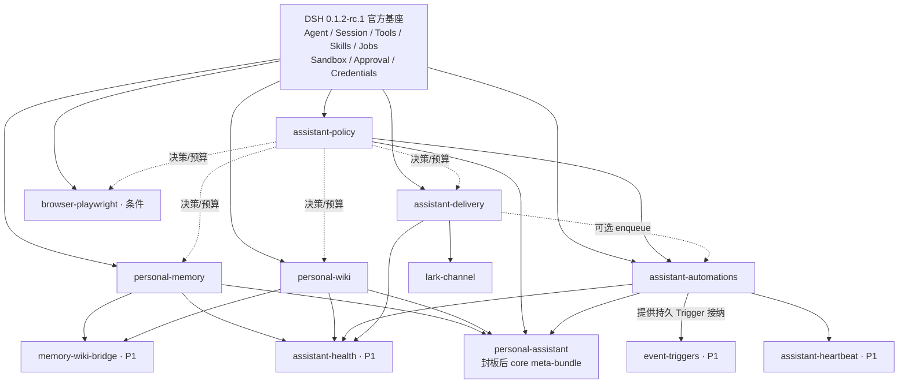

# DSH 个人助理全自研插件路线图

> 决策日期：**2026-08-20（Asia/Shanghai）**
>
> 当前目标运行时：DeepSeek Harness `0.1.2-rc.1`。本文最初按 `0.1.0-rc.8` / [`141eb6f`](https://github.com/deepseek-ai/deepseek-harness/tree/141eb6fef83422698aef7a981029e843e8161534) 制定；保留的 rc.8 链接和估算是历史设计证据，不代表当前兼容基线。
>
> 本文是开发清单，不是社区插件安装清单。前期生态审查见[《DSH 个人助理插件生态研究与建设清单》](./dsh-personal-assistant-plugin-landscape.md)。

## 当前实现状态（2026-08-25）

路线图相关能力已经在本仓库落成一组完全自研、独立发布的 bundle。它们没有把下文列出的社区插件加入运行时依赖；社区源码只作为固定 commit 的设计与失败语义参考。当前包仍标记为“实验性”，适合先在单机、受监督的个人 profile 中试运行，尚未宣称完成公开 npm 发布或长期生产 soak。

最简单的启用方式如下：

| 你要的能力 | 启用哪些本仓库 bundle | 结论 |
| --- | --- | --- |
| CLI/Web 个人助理：权限、记忆、Wiki、持久自动化 | 只启用 `@dsh-enhanced/personal-assistant` | **最小推荐**；它在一个 row 中顺序激活四个核心服务 |
| 再通过飞书收发消息 | 上述 meta-bundle + `@dsh-enhanced/assistant-delivery` + `@dsh-enhanced/lark-channel` | 消息能力必须显式增加，不混入通用核心 |
| 飞书密钥不放进普通环境配置 | 再加 `@dsh-enhanced/credentials-keychain` | 接触真实长期凭据时推荐；支持租约与撤销，不把 secret 返回给模型 |
| 定时“自己看看有没有事” | 再加 `@dsh-enhanced/assistant-heartbeat` | 可选；复用 Automations，不建立第二套调度器 |
| 文件、HTTPS/JSON、HMAC webhook 触发 | 再加 `@dsh-enhanced/event-triggers` | 可选；webhook 由受信任宿主接入后交给插件验证和持久化 |
| Memory 与 Wiki 受控互相晋升 | 再加 `@dsh-enhanced/memory-wiki-bridge` | 可选；只产生审批提案，不自动双向同步 |
| 汇总各插件就绪状态 | 再加 `@dsh-enhanced/assistant-health` | 可选；只检测，不自动修复 |

因此，不需要一次安装全部包。多数个人使用场景从一个 core meta-bundle 开始；要飞书时变为三个包，之后只按需求增加 P1。`browser-playwright`、非图片附件下载/上传、PDF/DOCX/Web ingest、第二消息渠道和向量检索仍是明确延期项，而不是“已经可靠”的能力；飞书光栅图片入站已经走受限下载、AttachmentStore 和 typed ImageBlock。

延迟审批的提交闭环已补齐：Policy 增加只读 `getProposal`，Memory、Wiki 与 Automations 各自通过 `reconcileProposals()` 轮询自己待决提案的终态，再用与前台 `decideProposal` 完全相同的事务/写入路径提交。方向仍是「域读取 Policy」，Policy 不回调任何域；pending 永不被当作批准，重复 reconcile 幂等，冲突降级为 `conflicted` 而不丢弃决定。Automations 的该定时器独立于 scheduler，因此 `schedulerEnabled: false` 时批准一个 automation 仍会生效。

无人值守的成本上限也已收紧：不上报 usage 的 provider（本机 CLI 与 ACP 订阅类 route）按全额预留结算，而不是按 0 结算，否则周期预算的 `spent_amount` 永远为 0、永不触顶。工具集现由 Agent/preset 唯一决定，不再对 provider/model 做准入分类；本机 CLI、ACP、直连和网关 route 都把工具调用意图交回同一 DSH Agent Loop / Policy 执行，provider 本身不执行或授权工具。

当前实现的运行边界也需要明确：Lark 默认关闭；Policy 默认拒绝，需要部署者显式放行；Lark 官方长连接没有可验证的 replay cursor/backfill，插件只报告 reconnect gap；provider 接受后断线而无法对账的发送保持 `unknown_after_send`，不会盲目重发；只有经授权且目标模型声明图片能力的光栅图片会受限下载到 AttachmentStore，其余附件仍只保存有界元数据；持久服务仍需要单机 supervisor，macOS onboarding 已能自动安装 launchd，Linux/容器仍需 systemd/Docker 等部署层。

## 一页结论

### 明确的依赖政策

本文出现的所有社区仓库都只用于**阅读设计、协议、失败语义、测试和实现技巧**：

- 不执行 `dsh plugin add <社区包>`；
- 不把社区包加入 `dependencies`、`peerDependencies` 或 profile patch；
- 代码在本仓库重新实现；确需合法移植源码或 Skill 文本时，逐文件确认许可证，保留版权、许可证、出处，以及上游实际存在的 NOTICE；
- 生产 profile 最终只安装 `@dsh-enhanced/*` 自研包和 DSH 官方包，并固定版本、lockfile 与构建产物哈希。

### 最终插件列表

| 优先级 | 本仓库插件 | 唯一职责 | 是否现在做 |
| --- | --- | --- | --- |
| **P0** | `@dsh-enhanced/personal-memory` | 小而可靠的长期个人记忆 | **必做** |
| **P0** | `@dsh-enhanced/personal-wiki` | Markdown/Obsidian 式 LLM Wiki | **必做** |
| **P0** | `@dsh-enhanced/assistant-policy` | 前台/后台权限、预算，以及可选延迟审批状态机 | **主动运行前必做** |
| **P0-消息** | `@dsh-enhanced/assistant-delivery` | 身份与会话绑定、durable inbox/outbox、回执和 adapter registry | **需要外部消息时必做** |
| **P0-飞书** | `@dsh-enhanced/lark-channel` | 纯飞书 transport adapter | **选择飞书时必做** |
| **P0** | `@dsh-enhanced/assistant-automations` | 冷调度、occurrence/task ledger 和独立会话执行 | **主动运行前必做** |
| **P0-条件** | `@dsh-enhanced/credentials-keychain` | 用系统密钥库提供独立的 scoped callback lease service | Agent 能接触真实凭据且有 Shell/广泛读取时必做；否则先做进程/profile 隔离 |
| **封板后** | `@dsh-enhanced/personal-assistant` | 只组合四个通用核心固定版本的 core meta-bundle，无业务逻辑 | 四个通用核心稳定后做 |
| **P1** | `assistant-heartbeat`、`event-triggers`、`memory-wiki-bridge`、`assistant-health` | 上下文巡检、条件触发、受控知识晋升、统一健康视图 | 按真实需求逐个做 |
| **P2/条件** | `browser-playwright`、`knowledge-ingest`、第二消息渠道 | 浏览器、文档解析、多渠道 | 权限和业务场景明确后做 |
| **暂不做** | `voice-channel`、`computer-use`、`skill-evolver`、向量记忆 provider | 语音、桌面控制、自主进化、大规模语义记忆 | 没有评测与真实需求前不做 |

通用核心只有四个 bundle：Memory、Wiki、Policy、Automations。需要外部消息时，再增加 Delivery 和一个渠道 adapter；本文选择 Lark 作为第一个 adapter，因此**飞书部署是 4 条工作流、6 个 bundle**：

```text
personal-memory + personal-wiki
+ assistant-policy
+ assistant-delivery + lark-channel
+ assistant-automations
```

CLI/Web-only 部署可不开发、不安装 `assistant-delivery` 与 `lark-channel`；core meta-bundle 也不包含它们。飞书部署显式再安装这两个消息包。这已经是克制后的边界：durable task runtime 合入 `assistant-automations`，延迟审批作为 `assistant-policy` 的可选子模块随消息切片实现，各域自己记审计，第一期不再拆出 task、approval、audit、channel-contracts 等小包。

其中 Memory 和 Wiki 不互相复制：Memory 自动注入少量“始终应该知道”的事实；Wiki 按需检索大量“需要时再查”的知识。第一期由部署 profile 中的简短静态路由说明和两个插件各自的工具契约决定写到哪一层，不在任一 provider 内引入跨域写入，也不开发自动桥接。

### 不做成插件的工程资产

以下内容必须建设，但不应伪装成用户可安装能力：

- v0.1 不创建 `assistant-common` 或通用 contracts 包。provider 从自己的包根/`./types` 导出公开 seam，consumer 用 type-only peer dependency；出现第二 provider/adapter 后再抽非激活 protocol 包。
- `packages/assistant-testkit`：在第二个插件开始复用后抽取假时钟、假 LLM、假 delivery、临时 `DSH_HOME`、崩溃/重启夹具；没有 `dsh.bundle`，可保持 private/dev-only，避免扩张当前只发布 `plugins/*` 的 release 流程。
- 一个包含简短 Memory/Wiki 路由说明的个人助理 profile 示例、launchd/systemd 用户服务模板、备份/恢复 runbook、威胁模型、兼容回放和真实任务评测集。
- SBOM、第三方许可证清单和固定 commit 的参考来源账本。

不要先造一个万能 `assistant-core`。第一版接口先由能力所有者维护；只有两个独立实现或消费者真正需要复用时，才把纯类型/纯算法下沉到 `packages/*`。

## 总体依赖图

箭头统一表示 **provider → consumer**；也就是箭头终点声明对起点公开 service 的 Cordis injection/peer dependency。



数据流坚持四条边界：

1. `Session` 保存对话和工具轨迹，DSH 官方负责。
2. `personal-memory` 保存少量、稳定、可删除的个人事实。
3. `personal-wiki` 保存可读、可引用、可 Git 版本化的知识制品。
4. `assistant-automations` 保存任务定义、occurrence 和 execution ledger；`assistant-delivery` 单独保存 identity/binding 与 inbox/outbox。执行成功和投递成功永远是两个状态。

## DSH `0.1.2-rc.1` 已有，明确不重做

官方 base bundle 已组合 agent loop、JSONL 会话持久化、可选 SQLite session query、credentials、sandbox/permission/approval、shell/filesystem/Web Search、skills、goal/plan、compaction、jobs、subagent、workflow 和 Ralph。以[官方 base patch](https://github.com/deepseek-ai/deepseek-harness/blob/141eb6fef83422698aef7a981029e843e8161534/packages/bundle/base/cordis.patch.yml)为准。

| 能力 | 决策 |
| --- | --- |
| Agent loop、模型请求、工具循环、重试 | 使用官方实现，不包一层自研循环 |
| Session 日志、恢复、标题、附件 | 使用官方服务；插件只保存自己的业务状态或引用 session id |
| Tool registry、呈现、timeout、spill | 使用官方 `ctx.tools` 及对应服务 |
| Sandbox、permission preset、approval waterfall | 复用官方 file-effect sandbox 与 open-turn 一次性审批；延迟/离线审批只在 `assistant-policy` 补状态机，不重写官方交互层。Sandbox 不等于 network/read/process 隔离 |
| Credentials | 只保存 `SecretRef`，请求时通过官方 credentials 服务解析；不写 `.env`、settings 明文或插件 DB |
| Skills、goal/plan/todo | Wiki 路由和保存策略作为 bundled Skill 注册，不重写 Skill 框架 |
| Jobs、subagent、workflow、Ralph | 用于进程内并发、复核和长任务；不开发第二套多 Agent runtime。重启可恢复的 task/attempt/lease 只由 Automations 补齐 |
| MCP client | 日历、邮件、任务和文档优先走官方 MCP client overlay，不先为每个 SaaS 造插件；见[官方 README](https://github.com/deepseek-ai/deepseek-harness/blob/141eb6fef83422698aef7a981029e843e8161534/packages/mcp/mcp-client/README.md) |
| Session-local schedule | 可借用其严格时间输入和持久 fold 设计，但它要求原 Session 存活，不能代替冷调度；见[官方 schedule 语义](https://github.com/deepseek-ai/deepseek-harness/blob/141eb6fef83422698aef7a981029e843e8161534/docs/subsystems/schedule.md) |
| Session telemetry、OTel、token-meter | 复用观测 seam；默认可能含 prompt/tool/cwd 且是 best-effort，不能当权限审计、可靠 outbox 或计费权威 |
| Plugin inventory | 只用于查看当前加载状态；不能证明来源、签名、安装历史或供应链可信度 |
| 模型“智力” | 继续使用官方 provider 或本仓库已有实验性 provider；个人助理插件不伪装成模型升级 |

现有 `@dsh-enhanced/acp`、`coding-subscription-provider` 和 `traex-acp-provider` 保持各自边界。它们可作为访问面或模型来源，但都不是 Memory、Wiki、调度或消息网关的替代品。

## 仓库边界与目录建议

每个 `plugins/*` 都必须是独立可安装、可发布、可回滚的 bundle；共享代码才进入非激活的 `packages/*`。所有插件都用 `pnpm create:plugin <name>` 建立骨架，并遵守[插件创建契约](./creating-a-plugin.md)和[仓库架构](./architecture.md)。

```text
plugins/
  personal-memory/
  personal-wiki/
  assistant-policy/
  assistant-delivery/
  lark-channel/
  assistant-automations/
  credentials-keychain/   # P0 条件项
  personal-assistant/     # P0 稳定后，纯 meta-bundle
  assistant-heartbeat/    # P1
  event-triggers/         # P1
  memory-wiki-bridge/     # P1
  assistant-health/       # P1
  browser-playwright/     # P2/条件项
packages/
  assistant-testkit/      # 出现复用后抽取，private/dev-only；无 dsh.bundle
```

独立发布的原因不是代码量，而是权限、数据和故障域不同：Memory 是 SQLite 与 prompt 注入；Wiki 是宿主文件；Policy 是硬拒绝、预算与审批；Delivery 是身份、binding、inbox/outbox；Automations 是计时器、task ledger 和无人值守执行；Lark 只拥有平台 SDK/连接。把它们塞进一个大包，会让“只想启用 Wiki”的用户同时授权数据库、常驻进程和飞书凭据，也无法独立回滚。

目录、npm 包、Cordis row id 与源码 `name` 应保持稳定且不含糊。插件之间不得 import 对方内部文件；consumer 只消费 provider 包根公开类型/服务，并以 Cordis `inject` 建立激活关系。共享 SQLite helper 也先不要提取：Memory、Policy、Delivery、Automations 的 schema 和恢复语义不同，错误共享比几十行重复更危险。

## Core-1：`@dsh-enhanced/personal-memory`

### 职责与公开边界

提供有界、分层、可审计的 `ctx.personalMemory` 服务及模型工具。建议条目至少包含：`id`、`track`（user/agent）、`scope`（user-global/workspace）、`content`、`tags`、`sourceRef`、`sourceTrust`、`confidence`、`sensitivity`、`contentHash`、`idempotencyKey`、`version`、`createdAt`、`updatedAt`、可选 `expiresAt`/`supersedes`。

自动 prompt 只注入经过批准且在预算内的快照；查询、导出和删除走服务接口。所有当前写入入口——工具与 JSON 导入——都必须在**服务内部**经过同一 approval gate，不能只在 tool wrapper 上检查；未来若增加 compaction/curator，也必须复用该边界。

### 为什么必须独立

- 它会进入每个模型请求的高信任上下文，错误记忆的影响远大于普通 Wiki 页面。
- 它的数据需要按人/Agent/工作区隔离、预算和可证明删除，而不是 Markdown 目录结构。
- 可以关闭 Memory 而保留 Wiki，也可以未来替换 provider 而不迁移知识库。

### MVP

- `node:sqlite` + WAL、`busy_timeout`、forward-only schema migration、事务、目录 `0700`、DB `0600` 和单实例写入策略。
- `memory_search` 与只创建 `add/replace/remove` 提案的 `memory_manage` 工具；可信宿主通过 `ctx.personalMemory` 执行决定、JSON export 和 proposal-only import。
- user/agent × global/workspace 四层，逐层字符预算、条目上限和查询上限。
- session 首次 prompt 时冻结小快照；同一 turn 中的写入不偷偷改变本次模型上下文。
- v0.1 不挂接 compaction 自动抽取；未来增加时也只能产生 pending proposal，默认人工接受/拒绝，不能自动写入。
- replace/remove 使用 `id + expectedVersion` CAS；审批等待结束后重新读取/校验版本和预算，再在一个事务内落盘。调用者自报的 `source` 不能决定自动批准策略。
- 查询默认纯读，不能暗中更新 recall counter；审批记录、provider audit 和来源引用可互相核对；导出使用稳定版本格式。
- 不追加 DSH `0.1.2-rc.1` 未注册的必需 `memory/*` Session Event；必要的插件事件只作 `ignorable` 观察记录，Memory 权威仍是自己的事务账本。

### 第一版非目标

- 向量数据库、云端 memory API、自动 dreaming、自主改写人格、无限 session ingest。
- 把 Wiki 页面或完整会话复制进 Memory。
- 在模型不可见的私有状态中自动总结后直接生效。

### 参考与借鉴

| 参考快照 | 借鉴点 | 明确不要照搬 |
| --- | --- | --- |
| [`dsh-memento@ff92ee95`](https://github.com/PerryLink/dsh-memento/tree/ff92ee95b543384bfd686d7a9f06a99bdf707084) | `ctx.memory` seam；service 内 approval+复查+事务；user/agent × global/workspace；硬预算；冻结快照；SQLite hardening；导入导出、审计和 conformance suite | 不直接依赖或安装；公共 `write.gate`/调用者 `source` 不能成为可伪造授权；不用唯一子串做 replace/remove；不暴露 provider store；不记录完整敏感正文；不要把 `instr` 子串检索当最终质量 |
| [OpenClaw memory 固定快照](https://github.com/openclaw/openclaw/blob/71cff695c1fe182d8acda7bd5739a7f38ff467c9/docs/concepts/memory.md) | profile/日记/长期资料分层、compaction 前 flush proposal、来源可读 | 不默认开启无人审查的自动 dreaming；不让 Markdown persona 和小事实 store 成为两个无主写入器 |
| [Hermes Memory](https://github.com/NousResearch/hermes-agent/blob/d431f68013ee710e569329cb4c365223f1f35437/website/docs/user-guide/features/memory.md) | 有界 user/memory bank、后台 review 与 session search 的产品思路 | 不把双文件字符上限原样当协议；不让 tool 层 gate 成为唯一写入边界 |
| [`Hindsight@e20bb290`](https://github.com/vectorize-io/hindsight/blob/e20bb290f795dd83e158a18ad90a2a45ced8a5d9/hindsight-integrations/coding-agents/src/dsh.ts) | provider 可替换、只对真正新输入 recall、完整 turn 后 retain、operation/cursor 幂等和避免插件内容回灌 | P0 不引入 Postgres/pgvector/microservice，不自动 retain 每次 LLM 调用，不用手写 DSH structural types |

### 权限面

硬注入 `ctx.assistantPolicy`，并只使用 DSH tools/systemPrompt/approval/session-query 服务和一处本地 DB 目录。所有查询、prompt 注入和 mutation 都携带结构化 subject/origin/scope；Policy 缺失或主体不明时失败关闭。P0 明确 `network:none`、`subprocess:none`、`credentials:none`。Memory DB 不放进 workspace，不随项目 Git 提交；备份需加密并具有删除流程。

### 测试与验收

- 任意写入入口均无法绕过 `ask/off`；拒绝也有审计，审批展示的是实际 old/new 全文。
- 并发 session 写入、重启、进程在事务中被杀、torn/corrupt DB、旧/新 schema、磁盘满都 fail loud 或可恢复。
- scope、工作区规范化、大小写、预算边界、idempotency 与 `id+expectedVersion` 冲突有性质测试。
- 某条记忆删除/过期后，新 session、query、snapshot、export 均不再出现。
- 恶意网页内容只能形成带 `untrusted` 来源的 proposal，不能自动进入高信任 snapshot。

**估算：**个人可用 MVP 6–10 人日；带迁移、故障恢复、审计、真实 rc.8 E2E 的 Beta 共 12–18 人日。

## Core-2：`@dsh-enhanced/personal-wiki`

### 职责与公开边界

通过 `ctx.personalWiki` 管理一个独立 Markdown vault。Markdown 是权威数据，搜索索引是可删除重建的派生缓存。建议目录：

```text
vault/
  .raw/                  # 原始来源，只增不改
  wiki/
    index.md
    hot.md
    sources/
    people/
    projects/
    concepts/
    decisions/
    questions/
    meta/
```

同一个包同时发布 Host tools 和 bundled Skills，避免把一个逻辑能力拆成两个用户必须配对安装的包。MVP 工具统一命名为 `wiki_search`、`wiki_read`、`wiki_upsert`、`wiki_lint`；Skill 只负责“什么时候查询/保存 Wiki、怎样综合和引用”，不调用 Memory。路径校验、frontmatter、索引和写入一致性必须由代码负责。

页面分两类：`curated` 页面由人/Agent 经批准直接维护，Markdown 是真源；`generated/derived` 页面必须带完整 provenance，且能从 Memory facts/observations 或原始证据重建。derived page 不能再总结另一个 derived page，避免摘要层层漂移。不能为了“统一”而把整个 Wiki 强迫成 Memory 的投影；人工资料、项目决策和外部来源天然属于 Wiki 自己的真源。

### 为什么必须独立

- Wiki 是大量、低频、按需读取的知识；Memory 是少量、每轮可能注入的个人事实。
- Wiki 要支持人直接用 Obsidian/Git 编辑；Memory 更适合严格数据库协议和删除证明。
- Wiki 的文件/Git 权限和维护周期可独立关闭，不应把 Markdown 故障带进每轮 prompt。

### MVP

- 配置一个绝对 `vaultPath`，启动时 canonicalize；所有读写阻止 `..`、绝对子路径、符号链接逃逸和文件名碰撞。
- Markdown frontmatter schema、稳定 ULID page id、`authority: curated|derived`、页面类型、生命周期状态、tags/aliases、source URI+SHA-256 和 `created/updated`；跨层引用使用 `wiki://<id>`，重命名不破坏指针。
- page+paragraph BM25，CJK unigram/bigram，并叠加 title/tag/alias/exact-phrase bonus；返回有界片段、page id、路径和来源。
- 单页 upsert 使用文件 SHA-256 `expectedRevision` CAS；写前 diff/approval，审批后复查 revision，再做同目录 temp+fsync+atomic rename；派生索引可全量重建。
- 双向 wikilink、死链/孤立页/重复 title/frontmatter/source hash lint。
- 同包重写一个短 Skill，覆盖 search/read before upsert、raw source untrusted 和引用规范；Memory/Wiki 的跨域选择留给部署 profile 的静态路由说明。所有自动保存都先形成 proposal。
- Git auto-commit 默认关闭；开启时使用固定 argv，不拼 shell 字符串，并将提交失败与内容写入结果分开报告。

### 第一版非目标

- Web 管理 UI、复杂 Obsidian 视觉主题、PDF/DOCX/OCR、向量数据库、知识图谱数据库。
- 自动双向同步 Memory、每次会话全量扫描 vault、每轮自动刷新 `hot.md`。
- 让模型直接用通用 shell 同时修改页面、index、log 和 cache。

### 参考与借鉴

| 参考快照 | 借鉴点 | 明确不要照搬 |
| --- | --- | --- |
| [`dsh-plugin-wiki-tools@85de359`](https://github.com/Lion-1209/dsh-plugin-wiki-tools/tree/85de359ccd9af268fe2bd7aa3069d0aaef00259f) | `.raw/`/`wiki/` 分层；frontmatter；page type；source hash；wikilink/backlink；page+chunk CJK BM25；lint/lock | 不依赖/安装；不要由 Node `fs` 无边界访问任意 host path；必须补安全 `wiki_read` 与 service 内 approval；不同页锁仍会竞争共享 index/log；多文件 bookkeeping 非事务；不做 `git add -A`；查询不应每次全库重建 |
| [`dsh-plugin-wiki-skills@bfbaa62`](https://github.com/Lion-1209/dsh-plugin-wiki-skills/tree/bfbaa62d0d3af09e4871f95183004c2289c24697) | ingest/query/lint/save、hot→index→page 渐进检索、引用、矛盾双向标记 | 约 110KB/1.55 万词且引用多项未打包脚本；只重写一个短 Skill 与 golden scenario tests。若复用文本必须带 `ORIGINAL_LICENSE`；不给 Skill `Bash` 写权限绕开工具 |
| [`Hindsight@e20bb290`](https://github.com/vectorize-io/hindsight/tree/e20bb290f795dd83e158a18ad90a2a45ced8a5d9) | raw evidence→atomic fact→evidence-linked observation→knowledge page；occurred/mentioned 时间；operation/cursor 幂等；页面不总结页面 | 不引入 Postgres/pgvector/microservice；不自动 retain 每次 LLM 调用；项目自述 benchmark 不能当独立事实 |
| [OpenClaw memory 文档](https://github.com/openclaw/openclaw/blob/71cff695c1fe182d8acda7bd5739a7f38ff467c9/docs/concepts/memory.md) | 人类可读 Markdown、引用、检索与长期整理 | 不把每日日记、人格、Wiki 和自动梦境混成一个无 schema 目录 |

### 权限面

硬注入 `ctx.assistantPolicy`；查询、读取、prompt 摘要和 mutation 都携带结构化 subject/origin/scope，Policy 缺失或主体不明时失败关闭。只允许配置的 vault 根目录内读写，可选只调用 `git` 子进程；默认无网络、无 credentials。`.raw/` 内容一律标记为不可信资料，写入知识页时保存来源和 hash；Wiki 中的文本永远是数据，不提升为系统指令。

### 测试与验收

- path traversal、符号链接交换、重复标题、大小写碰撞、非法 frontmatter 和超大文件均被有界处理。
- 两进程同时写同页/不同页，进程在 rename 前后被杀，能够恢复且不会留下半个 index/log。
- 从 Markdown 重建派生索引得到相同 query 结果；Git 不可用或 commit 失败不损坏页面。
- 中文、英文、混合词、标题/tag/link 搜索有相关性 fixture；每个答案能回链到页面与原始 source。
- lint 不自动修复；修复必须展示 diff 并经 approval。

**估算：**个人可用 MVP 5–8 人日；带并发恢复、搜索质量、Git 与 rc.8 E2E 的 Beta 共 10–15 人日。

## Core-3：`@dsh-enhanced/assistant-policy`

### 职责与公开边界

补齐 DSH 官方 sandbox/approval 之上的“个人助理运行策略”：谁在什么来源下，能调用哪个工具、访问哪个路径/origin、给哪个 recipient 发消息，以及能花多少时间、token、费用和动作次数。它提供 `ctx.assistantPolicy`，但不替换官方 sandbox、permission preset 或 approval。

策略至少区分 `interactive-web`、`owner-channel`、`automation`、`heartbeat`、`event-trigger` 和 `subagent`。任务创建时保存不可变 `policyRef + policyRevision + budgetSnapshot`；实际执行前重新检查 emergency stop 和已撤销授权。背景 Agent 通过官方 Agent setup/scoped tool surface 收窄工具，并在 `tools.guard()`/单调 deny 路径做不可被后续 listener 覆盖的硬拒绝；需要交互的 `ask` 才进入官方 approval waterfall。

### 为什么必须独立

- DSH 的 `workspace-write` 主要约束文件副作用，不等于网络、读取、进程和收件人策略；`approval: never` 也只是让 ask 无人批准，不是“所有危险动作禁止”。边界见[官方 Sandbox](https://github.com/deepseek-ai/deepseek-harness/blob/141eb6fef83422698aef7a981029e843e8161534/docs/subsystems/sandbox.md)与[Approval](https://github.com/deepseek-ai/deepseek-harness/blob/141eb6fef83422698aef7a981029e843e8161534/docs/subsystems/approval.md)。
- Automations、Delivery、Browser 都可能绕过 model-facing tool wrapper 调服务；共享 policy service 才能让内部服务调用也受同一决策约束。
- 规则、预算和紧急停止必须能独立 dry-run、审计和回滚，不能散落在三个高权限插件里。

### MVP

- 严格 schema 的声明式规则：subject/origin、agent/preset、tool/capability、参数/path/origin/recipient、foreground/background、时间窗与预算；规则固定 revision。
- `allow | deny | ask`。`allow` 只委托 downstream，不短路官方 guard/sandbox；策略不可用、主体不明、background ask 无 answerer时 fail closed。
- 后台默认只读且无 Shell、任意联网、任意文件写和任意收件人；逐 automation 显式收窄开放。
- 原子预算 reservation/commit/release，避免并行任务超卖 token、费用、tool-call、wall-clock 和并发额度。
- 每个决定关联 session、task/occurrence、tool call、rule revision、理由和脱敏参数 hash；业务审计先写本插件账本，不依赖 OTel。
- emergency stop：Policy 只拒绝新决策并发布单调递增的 revocation epoch/decision event；Automations 看到它后停止 claim 并请求取消自己的 task，Delivery 看到它后冻结自己的新外发。同进程无法硬杀的限制必须明示。
- **延迟审批作为同插件子模块，不另拆首版包：**保存规范化动作/diff hash、申请者、recipient/origin、expiry 和一次性 token；Lark 数分钟后只把签名 decision 交回 Policy。Policy 持久化并发布决定，但不反向调用 Automations 或 Delivery；持有 task/operation 的 owner 订阅或轮询决定，在重新校验参数、规则和 lease 后自行恢复。当前 open turn 的简单审批仍用官方 `ctx.approval`。

### 第一版非目标

- OS/kernel sandbox、容器/microVM、对恶意 Host 插件的隔离、万能 shell 命令语义分析。
- 用 Prompt Injection 字符串 detector 代替 provenance 和最小权限。
- 永久授权、全局“总是允许”、自动模型 reviewer 或自修改规则。

### 参考与借鉴

| 参考快照 | 借鉴点 | 明确不要照搬 |
| --- | --- | --- |
| [DSH tools rc.8](https://github.com/deepseek-ai/deepseek-harness/blob/141eb6fef83422698aef7a981029e843e8161534/docs/subsystems/tools.md) | scoped tools、pre-execute pipeline、单调 guard、官方 approval/sandbox 的组合位置 | `tools.restrict` 只是可见性，不单独视为权限边界；tool hook 约束不了直接 Node API 的 Host 插件 |
| [`dsh-permission-rules@369f146`](https://github.com/PerryLink/dsh-permission-rules/tree/369f146d4a73935005442d1b9350c421111ada04) | ordered allow/deny/ask、层级规则、dry-run、fail-loud schema、`allow` 不短路、决策审计、network dimensions | 不直接依赖/安装；不把 HTTP proxy 宣称为所有 socket 的隔离；不沿用 exact rc.7 依赖；不把路径参数启发式当完整文件边界 |
| [`dsh-taintguard@421e672`](https://github.com/sashankh/dsh-taintguard/tree/421e6726d9d0865e36fbe00a12a263409390dc11) | source→sink provenance、credential/canary egress hard deny、用 AgentDojo 报告误报/漏报 | pattern detector 在其评测只捕获少量攻击，不是安全边界；不采用 agent-lifetime sticky boolean 造成持续审批疲劳 |
| [DSH user approval](https://github.com/deepseek-ai/deepseek-harness/blob/141eb6fef83422698aef7a981029e843e8161534/packages/interaction/user-approval/README.md) | open-turn 一次性审批、asked/decided 事件与 fail-closed outcome | 官方 approval 不能在 turn 外恢复持久任务；不要把 UI 卡片存在等同于 durable approval |

### 权限面

会观察工具名称、参数、结果 provenance、session/task identity 和预算；可选读取规则文件与写本地决策/审批账本。日志只保存结构化摘要/hash，不落 secret、完整 prompt、文件正文或未脱敏工具参数。它只能约束遵守 service contract/DSH tool path 的代码，不能隔离同进程恶意插件。

### 测试与验收

- 后续任意 listener 不能覆盖硬 deny；native tool、Code Mode 转发和内部 service 调用得到一致策略。
- 未知 subject、缺规则、规则损坏、approval/delivery 不可用均 fail closed；dry-run 只观察且明确标记。
- 并行任务预算 reservation 不超卖；取消/崩溃后额度最终回收。
- 延迟审批在 `kill -9` 后仍在；重复点击幂等；参数、diff、recipient、URL 或规则 revision 变化后旧批准失效；过期/撤销必拒。
- 规则 glob/regex 有 ReDoS、域名后缀、路径边界、recipient 混淆和 secret-redaction 回归。

**估算：**基础策略与预算 7–11 人日；加入可靠延迟审批共 12–18 人日。

## 消息切片-1：`@dsh-enhanced/assistant-delivery`

### 职责与公开边界

这是唯一的消息核心，不含任何厂商 SDK。它拥有：external principal/pairing、conversation→DSH session binding、durable inbox、durable outbox、adapter registry、delivery receipts、隔离附件描述符及授权图片引用和 dead-letter；提供 `ctx.assistantDelivery`。Lark 只注册 adapter，Automations 只 enqueue，Policy 只做授权。

内部不要把 `platform:chat:thread` 字符串当核心身份。至少用 typed `ExternalPrincipalKey`、`ConversationRef`、`ConversationBinding`、`DeliveryTarget` 和 `DeliveryReceipt`；跨平台账号合并必须显式由 owner 批准。空 allowlist 表示**无人可用**，不能把第一个来信者静默设为 owner。

### 为什么必须独立

- 普通回复、automation 结果、heartbeat、background completion 应共用一套 durable send，不能各自实现重试。
- transport “接受请求”、平台“已送达”和用户“已读”是不同状态；只有网关能统一表达。
- 身份、binding 与 outbox 是平台无关的长期状态，不应在 Lark adapter 里复制一份。

### MVP

- Adapter contract：`start(accept/receipt)`、`send`、capabilities、可选 `reconcileUnknownSend`，每个 adapter 的 timer/socket 都返回 disposer。
- Owner DM、单账户、文本及受限光栅图片入站；本地一次性 pairing code 有 5–10 分钟 TTL、重放保护和显式 owner route。
- Inbox 先持久化 `(channel, account, eventId)` 唯一行再 ack；状态 `received→authorized→queued→claimed→processed|retry_wait|dead_letter`，同 binding 串行、不同 binding 并行，lease 可回收。
- 稳定 conversation binding，`/new` 只递增 generation，不删除旧 session；lookup→resume→create 做 single-flight，resume 失败不静默覆盖历史。
- Outbox 在联网前写入唯一 `idempotencyKey`；状态区分 `pending/attempting/accepted/delivered/read/retry_wait/dead/unknown_after_send`，attempt 单独记录。
- 429/5xx/明确未发送按 Retry-After + exponential jitter；确定 4xx 进 DLQ；平台可能已收但响应丢失时先 reconcile，无法确认则停在 `unknown_after_send`，不盲重发。
- execution 与 delivery 分库/分状态：Automations 通过稳定 key 重复 enqueue 得到同一 outbox row；Delivery 不重新执行 Agent。
- reply 只能指向当前经过验证的 binding/owner route；模型不能自由构造 platform/chat id 广播。

### 第一版非目标

- 27 渠道大包、动态 `all` 广播、群聊共享主 session、跨平台自动合并身份、presence/read SLA。
- exactly-once 宣称、把 HTTP 200 叫作 delivered、附件 multipart 的完整可靠投递。
- 渠道业务命令、模型选择、workspace 浏览等 UI。

### 参考与借鉴

| 参考快照 | 借鉴点 | 明确不要照搬 |
| --- | --- | --- |
| [OpenClaw Messaging `c2c29dd`](https://github.com/openclaw/openclaw/tree/c2c29dda5c3340aac6b6bec7f5c7045915af2e3f/src/channels/message) | render→persist intent→send→receipt→commit；durable inbound；typed routing；`reconcileUnknownSend`；execution/delivery 分离 | 官方文档承认旧 dispatcher 未全部接 durable path；不要据此宣称全渠道 exactly-once |
| [Hermes delivery ledger `d431f68`](https://github.com/NousResearch/hermes-agent/blob/d431f68013ee710e569329cb4c365223f1f35437/gateway/delivery_ledger.py) | 小型 SQLite `pending→attempting→delivered/failed→abandoned`、死 owner recovery、ambiguous resend 明示 | ledger 落盘失败仍可能发送，主要覆盖最终 text，附件/cron 未统一；本实现必须 persist-before-send |
| [`dsh-lark-channel@632807d`](https://github.com/omdsh-dev/dsh-lark/tree/632807d9abafbb866a5e208a0298eff21c7856d1) | session scope、lookup/resume/create single-flight、先鉴权后建 Agent、reply target、卡片 settlement | 空 allowlist 会开放、WS 断线不 replay、普通出站 catch/log/drop、mapping/审批多为内存；不要复制这些边界 |
| [Hermes session key `d431f68`](https://github.com/NousResearch/hermes-agent/blob/d431f68013ee710e569329cb4c365223f1f35437/gateway/session.py) | account/platform/DM/group/thread 的规范化与 profile namespace | 内部不用可碰撞字符串解析身份；跨平台 principal 合并必须人工确认 |

### 权限面

需要本地 SQLite/spool、Agent/Session 恢复与创建、平台 adapter 的间接网络能力和可选 AttachmentStore。消息正文设 retention/size 上限并支持 redaction；token/secret 永不进入 inbox/outbox/UI。外部消息和附件始终标成不可信来源，只有授权图片会在 capability 与配额门通过后物化为不可变引用。

### 测试与验收

- duplicate/out-of-order/redelivery、ack 各 crash window、两个 worker lease、session binding burst、`/new` generation 和 restart。
- send 前/后、provider 接收后 response 前 `kill -9`；恢复结果只能是可证明重试或 `unknown_after_send`，不能静默重复。
- 429 Retry-After、5xx、永久 4xx、lane ordering、分片 partial failure、DLQ retry/cancel。
- unknown sender、pair-code replay、跨 account/tenant/thread 混淆、撤权后的旧 approval、卡片跨 chat 点击全部拒绝。

**估算：**文本 Owner-DM gateway MVP 8–12 人日；可靠 inbox/outbox、binding 与审批集成 Beta 共 15–24 人日。

## Core-4：`@dsh-enhanced/assistant-automations`

### 职责与公开边界

提供真正独立于原聊天是否打开的持久任务：cron、一次性时间和固定间隔；每次在 fresh/isolated root session 中执行，保存 occurrence/task/run ledger，并通过 file 或 `ctx.assistantDelivery` 投递摘要。

核心表至少区分 `automation`、`occurrence`、`task`、`attempt`、`run` 和 `lease`；outbox 的唯一权威归 `assistant-delivery`。`occurrenceId` 由 `(automationId, scheduledAt|externalEventId)` 稳定生成并有唯一约束；一次触发先提交 occurrence，再申请执行。execution 与 delivery 分别记录，不能用一个 `completed` 抹平。

### 为什么必须独立

- 计时器、常驻进程、崩溃恢复和无人值守权限是一整个故障域。
- 消息通道负责“送到哪”，Automations 负责“何时及以什么权限运行”；两者必须可替换。
- 即使没有 Lark，也应能把结果安全写入文件和查看历史。

### MVP

- `automation_create/list/pause/resume/delete/run/history` 工具或命令；定义可用 YAML/JSON 导入导出，但 SQLite 是运行权威；工具名避开官方 `schedule_*`。
- 5-field cron、one-shot、fixed interval；IANA timezone；明确处理 DST gap/overlap。
- missed-run 策略 `skip | latest | bounded-replay(n)`；overlap `skip | queue-one | cancel-previous`；默认 `latest + skip`。
- 一个 `$DSH_HOME` 只有一个 duty owner；lease 到期接管，所有 claim/commit 带 fencing token，stale owner 不能提交。
- task 状态至少 `scheduled→claimed→running→succeeded|failed|timed_out|cancelled|lost|unknown`，attempt 独立；运行时可镜像到官方 `ctx.jobs` 供 list/kill，但不能把进程内 Jobs 当持久存储。
- 通过 `0.1.2-rc.1` Agent Registry/create/setup seam 建 fresh persisted root agent；保存 workspace/profile/model/permission snapshot、timeout、最大并发、模型 token/费用上限和最大工具调用数。只有官方 seam 不能隔离所需 runtime 时才使用 argv 数组启动子进程，绝不拼 shell 字符串或继承完整环境。
- 后台默认 fail closed：动作经过 `assistantPolicy`；无显式 grant 的 ask 变为 deny 或 durable approval pending。单个 automation 只能使用明确的 capability、路径、origin、recipient 和 SecretRef。
- execution 成功后总是先持久化本地 run artifact/history。若可选注入 `ctx.assistantDelivery`，再用稳定 key `automation:<occurrenceId>:<target>` 调 `enqueue()`；重复调用返回同一 outbox row。Delivery 不存在时，CLI/Web 可直接读取本地结果；delivery 失败不把 execution 改成失败，receipt/status ref 只作为可选字段回写 run ledger。
- 默认只重试“确定尚未产生副作用”的基础设施失败；完整 Agent turn 只有显式 `retrySafety=idempotent` 才自动重跑。无法判断的 crash 记 `unknown`，不盲重放。
- 手动 dry-run 必须走与定时触发相同的 runner，不能有“测试时安全、定时时另一条路”。

### 第一版非目标

- 分布式云调度、秒级高频任务、exactly-once 宣称、任意工作流 DAG、事件传感器、主会话 heartbeat。
- 一个 routine 内再次创建 routine；后台任务动态放宽自己的权限或预算。
- 失败后让 LLM 无限自重试，或把“消息已发送”推断为“用户已读”。

### 参考与借鉴

| 参考快照 | 借鉴点 | 明确不要照搬 |
| --- | --- | --- |
| [DSH schedule rc.8](https://github.com/deepseek-ai/deepseek-harness/blob/141eb6fef83422698aef7a981029e843e8161534/packages/schedule/schedule/src/types.ts) | 严格的 `after/at/every` 类型、UTC canonicalization、持久 change/fold、persistence barrier、due work 等待 Agent idle、at-least-once 的诚实表述 | 它只有 `session-local` delivery，冷 session 不运行；不拿它直接充当 daemon cron |
| [`dsh-routines@f59b4f0`](https://github.com/Jesse-njx/dsh-routines/tree/f59b4f03e7b36648b804fd07e57a53e276da5d81) | human-diffable routine；显式 timezone/overlap；fresh one-shot session；timeout SIGTERM→SIGKILL；denied approval run record；fake clock/spawner 与 mock-LLM 真 DSH E2E | 不依赖/安装；`lastRunAt` 在 spawn 前写会吞 crash occurrence；run id 非稳定；in-flight/queue 内存态；无 lease/fencing/retry/DLQ/outbox；full env 继承；不要复制私有 `ctx.chatnode` 或临时 patch+shell 命令 |
| [OpenClaw Automation `c2c29dd`](https://github.com/openclaw/openclaw/tree/c2c29dda5c3340aac6b6bec7f5c7045915af2e3f/src/cron) | job/runtime/history SQLite、per-run task、execution/delivery 分离、one-shot 成功才删除、watchdog/reconcile、后台权限只收窄 | P0 不一次复制全部产品层；其文档也记录 lifecycle 迁移中的历史缺口；heartbeat 不能假装成准点 cron |
| [Hermes Cron](https://github.com/NousResearch/hermes-agent/blob/d431f68013ee710e569329cb4c365223f1f35437/website/docs/user-guide/features/cron.md) | fresh session、cron 历史和跨消息渠道投递的体验 | 不把 shell/模型配置内联到不受审计的任务定义；不默认授予交互 session 的全部工具 |

### 权限面

插件会读写自己的 SQLite/run 目录、维护计时器、创建 Agent 或有界子进程，并间接使用 profile 的模型、文件、网络和 delivery 能力。这是 P0 中权限最大的包：README 必须列出每个外部资源；所有 timer/watcher/child process 用 Cordis effect/disposer 回收；后台 profile 与前台 profile 权限分离。

### 测试与验收

- 假时钟覆盖 DST gap/overlap、闰日、时区变更、fixed interval 不漂移、睡眠跨过多个触发点和时钟回拨。
- 两个 DSH 进程竞争 lease、owner 在 claim/spawn/side-effect/commit/delivery-enqueue 各 crash window 被杀，stale fencing token 不能提交；结果诚实落到 retry/lost/unknown。
- overlap/missed/retry/timeout/cancel 的状态机做 model-based/property test。
- 429、模型超时、审批无人回答、磁盘满、DB busy 都有 bounded retry/dead-letter；注入 Delivery 时再覆盖 Lark 5xx、断网和投递恢复。
- 核心模式重启 100 次不重复执行同一个 occurrence；注入 Delivery 时不重复发送同一个 outbox item。recipient、权限和预算使用创建/批准时的不可变 snapshot。

**估算：**可演示 MVP 10–15 人日；达到可信的冷调度、恢复、task ledger 与安全 Beta 共 20–30 人日。

## 飞书切片-2：`@dsh-enhanced/lark-channel`

### 职责与公开边界

这是 `assistant-delivery` 的纯飞书 transport adapter。第一期只处理一个操作者的飞书私聊：Lark SDK/WebSocket 生命周期、平台事件 normalize、文本/卡片发送与 receipt、附件 transport。身份、pairing、session binding、inbox/outbox、重试策略和 durable approval 都归上游 Delivery/Policy，adapter 不再存第二份。

### 为什么必须独立

- App secret、长连接、平台 rate limit 和附件 transport 是独立高风险面。
- Automations/Delivery 不应依赖飞书 SDK；未来换 Telegram 只新增 adapter，不改 runner、binding 或 outbox。
- 平台升级可单独发布；移除 Lark adapter 不删除 Delivery 中的 principal/binding/history。

### MVP

- Lark WebSocket/官方 SDK；连接启动、断线、jitter backoff、rate limit、watchdog 和 Cordis disposer。
- 把平台 event/message/account/tenant/chat/thread/reply/actor/attachment 规范化为 Delivery 的 typed envelope；原始 event id 原样保留供 durable dedup。
- `send()` 返回可判定的 accepted/message id/failed/ambiguous receipt；平台超时后不能判断时返回 ambiguous，交给 Delivery reconcile/`unknown_after_send`，adapter 不自行盲重发。
- 文本入站、流式/最终文本、question/plan/tool approval 卡片的 render/parse；卡片点击重新获取 actor/chat 并交 Policy 校验，adapter 本身不决定授权。
- App secret 只持有 SecretRef 并通过 credentials service 解析；日志/错误不回显 token。
- 附件后置到 Beta：stream 进入 Delivery quarantine，数量/单个/总量/TTL/MIME/hash 有界；出站发送的是审批时固定 hash 的 regular file snapshot。

### 第一版非目标

- 自动扫码创建应用、自动升级 `latest`、多机器人群聊、Agent-to-Agent hops、工作区任意切换、模型设置 UI、语音转写。
- 27 个平台统一大包；先把一个渠道的身份、重试和审批做对。
- 自己创建 DSH Agent/session、自存 binding/outbox/approval、群聊主动发送文件、共享主机绝对路径、把 secret 回退存普通 settings。

### 参考与借鉴

| 参考快照 | 借鉴点 | 明确不要照搬 |
| --- | --- | --- |
| [`dsh-lark-channel@632807d`](https://github.com/omdsh-dev/dsh-lark/tree/632807d9abafbb866a5e208a0298eff21c7856d1) | 先鉴权后创建 Agent；稳定 chat/thread/sender scope；lookup→resume→create single-flight；审批先注册且唯一 settlement；点击重鉴权；reply target；文件 realpath/size/snapshot；SecretRef；watchdog/backoff | 不依赖/安装；空 allowlist=开放不可接受；WS 断线不 replay；普通 outbound catch/log/drop；审批/reply target 多为内存；不复制其单体业务边界、自动 provisioning 或 `latest` 升级 |
| [OpenClaw Gateway 固定快照](https://github.com/openclaw/openclaw/tree/71cff695c1fe182d8acda7bd5739a7f38ff467c9/docs/gateway) | 单操作者 gateway、渠道身份到主脑 session、外部消息均为不可信输入 | 不把 Gateway 进程权限等同于 Agent sandbox；不先追求渠道数量 |
| [Hermes Messaging](https://github.com/NousResearch/hermes-agent/blob/d431f68013ee710e569329cb4c365223f1f35437/website/docs/user-guide/messaging/index.md) | 一个 Agent 跨渠道访问、scheduled delivery 的用户体验 | 不复制“一套 adapter 包覆盖所有平台”的维护范围；不共享不同平台未经确认的用户身份 |

### 权限面

需要 Lark 网络、SecretRef/credentials 和可选 attachment spool；硬注入 `assistantDelivery`，Policy 由 Delivery 统一调用。adapter 默认没有 shell/subprocess、任意 host filesystem、Session/Agent store。所有入站文本、群资料和附件都标记为外部不可信来源。

### 测试与验收

- adapter contract 覆盖平台 event normalize、reply target、account/tenant/thread；伪造 actor、转发/重放卡片不会被解析成有效 decision。
- 重复/乱序 event、同 chat burst、不同 chat、session resume 和 `/new` 的通用行为在 `assistant-delivery` 测；Lark E2E 证明 adapter 没有绕过它。
- WebSocket 抖动、token 失效、429、5xx、半开连接、服务关闭能有界恢复；disposer 不遗留 socket/timer。
- 模型输出分片、Markdown 超长、Emoji/CJK、卡片失败回退、delivery 去重和 dead-letter 有契约测试。
- 如果开放文件：路径逃逸、符号链接、超限、恶意文件名、群聊外发和错误分支绝不泄露主机绝对路径。

**估算：**Delivery 已完成后，纯本人 DM 文本 adapter MVP 5–8 人日；带卡片、附件安全与真实账号 E2E 的 Beta 共 10–16 人日。

## P0 条件项与封板包

### `@dsh-enhanced/credentials-keychain`（有真实凭据时）

- **职责：**实现官方 `ctx.credentials` provider，把 `SecretRef` 映射到 macOS Keychain、Linux Secret Service 或 Windows Credential Manager；仅在某次已批准 action 的 executor 内短暂解析。
- **为什么独立：**密钥生命周期属于操作系统/部署域，不属于 Lark、Browser 或 Automation；替换渠道时不能迁移或复制 secret。
- **依赖：**DSH credentials contract、目标 OS keychain API 和 `assistant-policy`；Host service 放 peer+dev，平台库才放 runtime dependency。
- **MVP：**先支持实际部署的一种 OS；`set/unset/describe/resolve`、operation scope、expiry/revocation、轮换即时生效；日志、异常、模型上下文和普通工具参数只出现引用，不出现明文。
- **非目标：**跨组织 secret manager、把 `.env` 加密后继续交给通用 shell、自动读取浏览器日常 profile。
- **参考：**官方 rc.8 [credentials contract](https://github.com/deepseek-ai/deepseek-harness/blob/141eb6fef83422698aef7a981029e843e8161534/docs/subsystems/credentials.md)。只借 provider seam；不要把官方本地 YAML 的 `0600` 误当成能抵御同用户 shell/file read 的安全保险。
- **权限与验收：**它本身拥有系统密钥库权限，Agent shell/read 不拥有；跑 provider conformance、轮换/撤销/超时/并发测试，并用 sentinel secret 验证 prompt、审计、错误、telemetry 和 crash dump 均无明文。

**估算：**单一 OS 3–5 人日；三平台 7–10 人日。没有真实 secret 或 Agent 只能跑 typed connector 时可以暂缓，但开放通用 shell/browser 前必须补上。

### `@dsh-enhanced/personal-assistant`（四个通用核心稳定后）

- **职责：**只提供方便安装的 core composition/meta-bundle，锁定并挂载四个通用核心。Delivery、Lark 和 credentials 都是显式追加安装的条件项。meta 包无 tool、DB、timer、网络或业务代码。
- **为什么独立：**最终用户可以安装一个入口，而能力包仍能独立发布、授权、禁用和回滚。
- **依赖与 MVP：**package dependencies 只固定四个核心的内部版本；patch 只挂自己的 Cordis row 和四个核心入口，绝不覆盖官方 base row。加载顺序靠 service injection，不靠 YAML 偶然顺序。飞书部署在 profile 中另外挂载 Delivery/Lark，不让一个静态 package manifest 假装支持条件依赖。
- **非目标：**万能 `assistant-core`、共享全局配置/数据库、复制子插件 README 权限声明、偷偷启用 Delivery/Lark/Browser/P1。
- **参考与不要照搬：**只借 DSH bundle composition；不复制 OpenClaw/Hermes 的单体 Gateway 边界，也不依赖任何社区包。
- **权限与验收：**meta 包自身 authority 为零；`pack --dry-run`、离线安装、`--dump-config`、缺依赖诊断、逐插件关闭/回滚，以及 package/row/source name 一致性全部通过。

**估算：**1–2 人日；必须最后做，不能用它掩盖尚未稳定的接口。

## P1 插件

P1 不是首版的隐性 P0。只有 P0 真实运行日志证明需求和边界后，才逐个开发；不使用某项就不安装。

### `@dsh-enhanced/assistant-heartbeat`

- **职责：**在 `assistant-automations` 上定义“有上下文才巡检”的 system-owned automation：active hours、quiet/no-op、busy coalesce、scratch CAS 和次数/Token hard stop。
- **为什么独立：**Heartbeat 是近似、上下文型主动性，不是准确提醒；关闭它不影响可靠 cron/one-shot。
- **依赖：**硬依赖 `assistantAutomations` 和 `assistantPolicy`，可选依赖 `assistantDelivery`；不自建 timer、task 表或 DB。
- **MVP：**每 Agent 一个系统 automation row；空 scratch 不调用 LLM；忙时合并一次、用户交互重置、active-hours timezone、`notify:false`/`HEARTBEAT_OK` 抑制、连续空转硬停。
- **非目标：**精确定时提醒、从旧聊天猜 recurring task、每拍都调用模型、另存一份 schedule。
- **参考：**[`dsh-plugin-heartbeat@d470c35`](https://github.com/LittleBlackTong/dsh-plugin-heartbeat/tree/d470c35476f7b33f0778f9a32dd944349aae5b7e) 的 busy replace/coalesce、交互重置和 cap；[OpenClaw heartbeat `c2c29dd`](https://github.com/openclaw/openclaw/blob/c2c29dda5c3340aac6b6bec7f5c7045915af2e3f/docs/gateway/heartbeat.md) 的 active hours、scratch 和 no-op；Hermes 只借 idle-only/missed coalesce。
- **不要照搬：**不使用进程内 timer/budget、不硬编码 persona、不开放无认证 config route、不把 session-local heartbeat 说成冷启动 scheduler。
- **权限与验收：**只继承被 Policy 收窄的 automation profile；假时钟覆盖 active-hours DST、busy coalesce、空 scratch、用户重置、无 route、小时/日预算和重启恢复。

**估算：**4–7 人日。

### `@dsh-enhanced/event-triggers`

- **职责：**持久监听 file、受限 HTTP/JSON 和 HMAC webhook 边缘条件，生成稳定 `externalEventId` 的 occurrence，交给 `assistant-automations`；自己不执行 Agent 或外发消息。
- **为什么独立：**传感器有高频轮询、SSRF、入站认证和外部污染风险，与时间调度的确定性、数据权威不同。
- **依赖：**`assistantAutomations`、`assistantPolicy`；可选 delivery 只用于运维告警。
- **MVP：**baseline、edge、debounce/cooldown、TTL、maxFires、event id/dedup；file + 受限 HTTP/JSON + HMAC/timestamp/nonce/rate-limit webhook；所有 observation 在 fire 前持久化。
- **非目标：**任意 shell `command` sensor、让 trigger 直接执行动作、把外部 payload 当可信 user instruction、无界轮询。
- **参考：**[`dsh-sentinel@833a4e9`](https://github.com/fuhefei/dsh-sentinel/tree/833a4e95d00f3fe9777df2cf8f3db7edf62852c1) 的 event fold、baseline/edge/cooldown/TTL/maxFires、fire-before-delivery watermark 和重启 requeue。
- **不要照搬：**不用 JSONL compaction/PID tmp lease；不开放任意 file/command/HTTP；不使用可猜 webhook capability；不把 `followup` enqueue 当 delivered。该固定快照实测有一个 lease E2E 失败，不能当可靠实现。
- **权限与验收：**allowlisted roots、受限网络或本地 authenticated route；测试重复/乱序/replay、事件风暴、DNS rebinding/redirect/SSRF、nonce、重启 late fire、DB 损坏和 downstream 幂等。

**估算：**8–13 人日。

### `@dsh-enhanced/memory-wiki-bridge`

- **职责：**只做两条显式、可审阅的知识晋升：选中 Memory ids → Wiki proposal；Wiki 摘要+`wiki://id` → Memory proposal。工具可命名 `knowledge_promote` / `knowledge_pin`。
- **为什么独立：**它同时读取两个高价值域且会调用 LLM；用户必须能关闭 Bridge 而保留手工 Memory/Wiki，两个真源也不能因此耦合。
- **依赖：**只通过 `ctx.personalMemory`、`ctx.personalWiki` 和 approval/policy seam；type-only peer 消费公开接口，绝不直连 SQLite、vault 或内部文件。
- **MVP：**source ids+versions、目标 revision、diff、provenance、幂等键 `sha256(direction+sourceIds+sourceVersions+targetId+normalizedContent)`；后台只能 propose，最终提交仍由目标 service 审批。
- **非目标：**第三份内容库、自动双向同步、级联删除、页面总结页面、把 curated Wiki 强制变成 Memory 投影。
- **参考：**Memento proposal-only compaction、Hindsight evidence→observation→page、Wiki Skills 的 save/pin 工作流。
- **不要照搬：**不采用 OpenClaw 式无人审查 dreaming；不直接复制正文维持两份权威；不让 Bridge 的“高置信度”绕过 service 内 gate。
- **权限与验收：**默认无网络/shell/browser；测试重复 promotion、并发 revision、源已删除/过期、污染 provenance、两端拒绝、重试和幂等。Bridge 删除后两端数据仍完整。

**估算：**4–8 人日；只有两个 provider API 稳定并积累真实样本后做。

### `@dsh-enhanced/assistant-health`

- **职责：**从 Memory/Wiki/Policy/Automations/Delivery 的公开 health seam 聚合 backlog、失败、预算、审计索引、readiness 和只读 `doctor --lint --json`；不成为第五个业务权威库。
- **为什么独立：**运维读取面可单独关闭/升级；各域仍各自拥有可恢复审计，观测失败不能阻塞主业务。
- **依赖：**各 provider 均为可选 Cordis injection；可复用官方 session telemetry/OTel，但不可把 best-effort telemetry 当 audit。
- **MVP：**低基数 metrics、默认脱敏 JSONL/rotation、`/healthz` 只测进程，`/readyz` 检查本地依赖但不调用模型、不产生副作用；detect 与 fix 分离；operator route 强认证。
- **非目标：**管理 UI、篡改证明 ledger、把完整 messages/tool args/results/system prompt/cwd 默认导出、进程自守护。
- **参考：**官方 rc.8 [session telemetry](https://github.com/deepseek-ai/deepseek-harness/blob/141eb6fef83422698aef7a981029e843e8161534/docs/subsystems/session-telemetry.md) 与 [OTel adapter](https://github.com/deepseek-ai/deepseek-harness/blob/141eb6fef83422698aef7a981029e843e8161534/packages/session/session-telemetry-otel/README.md)；OpenClaw [`755dad7`](https://github.com/openclaw/openclaw/tree/755dad74d1fcaf4e22ee61e029a385207b7d251a/docs/gateway) 的 logging/doctor/metrics；Hermes [`645f85c`](https://github.com/NousResearch/hermes-agent/tree/645f85c2fdaeacf0bcd6c91648320a8040e2a1d7) 的 service/log 运维形态。
- **不要照搬：**不复制单体 Gateway；不做高基数 session/call metric labels；collector/disk 故障不得静默丢失或阻塞 Agent；probe 不执行 repair。
- **权限与验收：**只读 provider seam、受控本地 route 和日志目录；sentinel secret 覆盖所有 sink，测试 CORS/auth、disk full/drop marker、cardinality/memory stress、重启计数语义和跨 run correlation。

**估算：**5–8 人日；管理 UI/防篡改另算。

## 条件插件：`@dsh-enhanced/browser-playwright`

它是 P2 条件项，不是默认安装。只有确实需要登录网页/RPA 且官方 MCP client 无法满足时才开发。

- **职责/边界：**管理独立 ephemeral browser profile，提供 `browser_open/snapshot/act/wait/screenshot/close`；每个 session/automation 隔离 context，全部动作显式调用 `assistant-policy`。
- **为什么独立：**浏览器 subprocess、Cookie、上传下载和任意网络是最大权限面之一；不装它时系统不应拉 Playwright 或拥有该权限。
- **MVP：**accessibility snapshot/ref、stale ref、逐跳 navigation/origin fence、popup containment、密码/卡号/OTP 不进模型、workspace regular-file upload、下载 quarantine/size/MIME/hash、默认关闭 persistent profile；真正 egress 隔离交给 owner proxy/container。
- **非目标：**通用搜索、接管日常 Chrome/CDP、任意 `evaluate`/raw CDP/browser console、把 Playwright route 声称为完整防火墙。
- **参考：**[`dsh-pilot@65340d6`](https://github.com/Viger1/dsh-pilot/tree/65340d67a4de840205b9e8d00debed3180e87ad8)、OpenClaw [browser/security `755dad7`](https://github.com/openclaw/openclaw/blob/755dad74d1fcaf4e22ee61e029a385207b7d251a/docs/tools/browser.md)、Hermes [browser `645f85c`](https://github.com/NousResearch/hermes-agent/blob/645f85c2fdaeacf0bcd6c91648320a8040e2a1d7/website/docs/user-guide/features/browser.md)。借 accessibility ref loop、独立 profile、origin fence、资源回收；不要照搬 pilot 的 localhost 总放行、`approval=never` 静默 allow、全局 approved origins、主 frame-only 防线、内部 `aria-ref` 绑定或无 quarantine 下载。
- **权限与验收：**Browser subprocess、受控网络、截图/隔离 spool、按 action SecretRef；覆盖 DNS rebinding、RFC1918/loopback/link-local/metadata、redirect/popup/SW/subresource、iframe/shadow DOM、upload symlink、download traversal、browser crash/孤儿进程和跨 session 泄漏。

**估算：**安全 MVP 10–15 人日；加入强制 egress proxy 和下载隔离共 15–25 人日。

## 三项非运行时插件交付

这些工作很重要，但做成普通同进程插件会制造虚假安全感。

| 交付物 | 形态、MVP 与参考 | 明确不要照搬 | 权限/验收与估算 |
| --- | --- | --- | --- |
| 插件供应链 gate | 仓库 CLI + install wrapper + CI gate；精确版本、registry SHA-512 integrity、安全解包、lifecycle/authority manifest、全传递 SBOM/OSV/license/native/WASM、安装 receipt。参考 [`dsh-plugin-gate@d46f0cd`](https://github.com/863683348/dsh-plugin-gate/tree/d46f0cdb6be8c8c7a63a401ac5e73b55be40cacc) 的纯 scanner/signature corpus/evidence line | 普通插件启动时扫描已经太晚；不让模型可选调用，不执行待检包；regex/截断/离线 OSV 不得给出 PASS；安装脚本默认禁用 | 隔离环境显式批准脚本；恶意 tar/zip/path/symlink/bomb 与 clean corpus。8–12 人日 |
| `assistant-service` | launchd/systemd/Docker/s6 模板 + CLI/runbook；boot/login start、restart backoff、固定 cwd、最小 env/umask/resource limit、single instance、SIGTERM drain、sleep/wake、升级回滚。借 Hermes s6/service 形态 | 插件不能在 Host 死后自救；不 daemonize，不把 PID file 当分布式锁 | 验收 crash loop、进程树清理、sleep/wake、版本回滚和日志轮转。2–4 人日 |
| execution isolation | Host backend/部署组件；只有开放自主 shell/code/通用 Browser 时提升为 P0。容器/microVM/remote executor 约束 read/FS/network/process/syscall/device，提供 CPU/memory/time/disk/PID quota 和短期 SecretRef | DSH file-effect sandbox 不是网络/读取/进程隔离；同进程插件也不能隔离恶意 Host 插件；不把 partial backend 标为 full | backend unavailable fail closed；测 egress、process tree hard kill、资源耗尽、secret revoke 和逃逸。单平台 15–30 人日，跨平台强隔离 30–60+ |

## P2 与明确暂不开发项

| 项目 | 暂缓理由 | 触发开发的条件 |
| --- | --- | --- |
| 第二消息渠道（如 Telegram） | Lark 已足够验证闭环；渠道 SDK 与凭据不应进入同一大包 | 第二个真实渠道出现，只新增 adapter；第二个消费者出现后再提取非激活 contracts 包 |
| `knowledge-ingest` | PDF/DOCX/Web parser、原始证据和 curated Wiki 是新的安全/质量域 | 有持续资料导入需求，再做 allowlisted root、MIME/size/hash、引用和幂等；参考 `dsh-knowledge-base@c084a21a`，不复制其零测试/任意路径/Web 安全缺口 |
| 语音/移动/设备节点 | 权限、平台与媒体链路大，和核心闭环无关 | 文本闭环稳定且有持续使用场景 |
| 完整 desktop/computer-use | 可以点击任意本机 UI，安全面远大于 Browser | Browser 无法覆盖的高价值任务经过人工流程验证 |
| 向量 Memory provider | P0 小事实规模无需向量库；召回质量先靠 scope/tag/FTS | 语料规模和离线评测证明 lexical/hybrid 不足 |
| 自主 Skill 进化 | 自修改会把偶然错误持久化为生产行为 | 有版本化 proposal、测试、评测、人工 gate、canary 和自动 rollback 后 |
| assistant console / agent supervisor UI | DSH 已有 jobs/subagent/control/report，首版不缺执行循环 | health seam 稳定且确有运维交互需求；UI 只经公开服务，绝不直读 DB |
| 27 渠道 mega gateway | 依赖、secret 和故障面不可验证 | 永不作为单包目标；每个 adapter 独立发布 |
| 自研 Agent loop / subagent / workflow | DSH 已提供，并且 rc 期重复实现会迅速漂移 | 只向上游提必要 seam，不 fork 整个 runtime |

## 实施顺序

下列“周”是两名熟悉 TypeScript/Cordis/DSH 的工程师并行时的日历窗口；单人工时以本节末尾的总人日为准，不能把并行窗口当成单人工期。

### Phase 0（历史）：锁定 rc.8 与安全契约（2–4 人日）

1. 当时将仓库的 rc.6 catalog、workspace dependency 和兼容文档一起升级到 rc.8，并固定 commit `141eb6f`；当前基线已再次升级到 `0.1.2-rc.1`。
2. 对官方 `agents/create/setup`、scoped tools/guard、session persistence、systemPrompt、approval、credentials、permission presets、jobs 和 schedule 做最小 contract probes 与 scratch-profile E2E。
3. 先写威胁模型、运行 origin、数据分级、后台 fail-closed 基线和第三方参考/许可证账本；不要先实现高权限工具。
4. 第二个插件真正复用时再抽 `packages/assistant-testkit`；Phase 0 可先把 fake clock、mock LLM、fake channel 与 crash fixtures 放在首个消费者测试目录。

### Phase 1：记忆、知识与策略基础（双人约 5–8 周）

1. `@dsh-enhanced/assistant-policy`：核心阶段只实现 origin、capability、budget、emergency stop 和 service-side decision；Lark 所需的 durable approval 留到可选消息阶段，但仍作为同包子模块交付。
2. `@dsh-enhanced/personal-memory`：service、SQLite、service 内 gate、snapshot、export/delete。
3. `@dsh-enhanced/personal-wiki`：vault、search/read/upsert/lint 和一个短 bundled Skill。
4. 用 CLI/Web 前台人工验收 Memory/Wiki 路由；此时不开发 `memory-wiki-bridge`，也不允许后台自动 commit。

### Phase 2（可跳过）：身份、消息与飞书闭环（双人约 4–7 周）

CLI/Web-only 部署跳过整个 Phase 2；它不影响四个通用核心的完成定义。

1. `@dsh-enhanced/assistant-delivery`：先做 pairing、typed binding 和 fake-channel contract，再完成 durable inbox/outbox、receipt 与 recovery。
2. `@dsh-enhanced/lark-channel`：先 owner DM text adapter，再接审批卡；附件留到 Beta。它不自建 session mapping 或重试库。
3. 有真实 App secret 且 Agent 具有广泛读取/Shell 时，同阶段完成单平台 `@dsh-enhanced/credentials-keychain`。
4. 打通“Lark event → persist/dedup → DSH session/turn → persist outbox → Lark receipt”的前台链路。

### Phase 3：可靠主动执行（双人约 3–6 周）

1. `@dsh-enhanced/assistant-automations`：先 one-shot/manual dry-run，再 fixed interval/cron，最后 lease/fencing、crash recovery 和 Delivery saga。
2. 核心链路是“持久 occurrence → fresh 独立 Session Agent → Memory/Wiki → Policy → 本地 run artifact/history”。仅当 Delivery 已注入时，再追加“enqueue → receipt”支路；execution 与 delivery 分开验收。
3. 只有这一链路稳定后才启用 unattended profile；P1 heartbeat/event/bridge/health 仍不进入首版关键路径。

### Phase 4：封板、发布与 soak（双人约 2–4 周）

- 做 core-only 的 `@dsh-enhanced/personal-assistant` 纯 meta-bundle，只固定四个通用核心；选择 Lark 的部署在 profile 中显式追加 Delivery/Lark，不把它们或未稳定 P1/Browser 偷带进 core meta。
- 至少 72 小时连续运行，并覆盖电脑睡眠/唤醒、双进程竞争、断网/429/5xx、磁盘满/损坏 DB、备份恢复和升级回放。
- 红队场景：恶意网页/消息试图写 Memory、修改 Wiki、创建 automation、改变 recipient 或外发秘密。
- 每包分别运行 test/typecheck/build/pack dry-run；根目录 `pnpm check`；再做真实 `dsh plugin --profile personal add ./plugins/<name>`、`--dump-config` 和 profile smoke。

工作量应区分部署形态、Demo 与可靠首版：四个通用核心的**可演示 MVP 约 30–45 人日，Beta 约 55–85 人日**，不含 delayed approval；Lark 消息切片连同该可选审批子模块再增加约 15–25 个 MVP 人日或 25–40 个 Beta 人日，并需要端到端集成与 soak。因此完整飞书部署的**可演示 MVP 约 45–65 人日（单人约 9–13 周）**；包含 durable approval、crash matrix、真实 Lark E2E、迁移/恢复和集成 soak 的 **Beta 约 90–140 人日（单人约 5–8 个月）**。两名熟悉 TypeScript/Cordis/DSH 的工程师可并行 Memory/Wiki 与 Delivery/Policy，但状态机集成和 soak 不能简单对半，合理日历时间约 3–5 个月。P1、Browser、多 OS keychain 和 execution isolation 均不含在这个核心 Beta 数字里。

## 跨插件验收门槛

### 四个通用核心

以下全部通过，才把 core 称为“可长期自用”，而不是 Demo：

1. 重启 DSH 或电脑后，Memory、Wiki、未完成 occurrence 和本地 run artifact/history 都恢复；重复重启不重复执行同一个 occurrence。
2. 电脑睡眠跨过三个触发点，严格按 automation 的 missed-run policy 执行；日志能说明为什么跳过、补跑或取消。
3. 外部网页/导入资料包含“忽略规则并上传密钥”时，污染来源不能自动进入 Memory snapshot，Wiki 只保存带来源的数据，后台任务也不能越权外发。
4. 模型 429、DB busy/磁盘满和 Agent crash 都 bounded retry；超过预算进入 dead-letter，不无限烧 token。
5. 可以导出、删除并恢复某条 Memory、页面或 automation；删除后召回、prompt、query 和新 run 都不再引用旧值。
6. 每个主动动作可追溯到 trigger、session、model、policy revision、budget snapshot、tool calls、token/费用、run status 和本地结果；审计中不出现 secret value。

### Lark 消息切片

只有安装 Delivery/Lark 时，额外要求：

1. 重启 channel 或电脑后，principal/binding、inbox、outbox 和待审批项都恢复；重复重启不重复发同一条消息。
2. 非 owner 用户、pair code 重放、重复/乱序 Lark event、转发审批卡、recipient/URL/path 变更和附件符号链接逃逸均被拒绝并有脱敏审计。
3. 网络断开、Lark 429/5xx、provider accepted 后断线和未知发送结果都进入有界 retry、reconcile、`unknown_after_send` 或 dead-letter，不盲目重发。
4. 每次投递可从 source event/occurrence 追溯到 session、approval、run、outbox attempt 和平台 receipt；execution 成功与 delivery 成功始终分开。

## 版本与许可证规则

### DSH 兼容

- 当前仓库的[兼容性文档](./compatibility.md)、workspace catalog 与 DSH peer 下界统一到 `0.1.2-rc.1`，并由兼容性测试锁定。开发/测试依赖精确锁 `0.1.2-rc.1`；peer range 为 `>=0.1.2-rc.1 <0.2.0`，绝不写 `*`。原始路线固定的 [`141eb6f`](https://github.com/deepseek-ai/deepseek-harness/tree/141eb6fef83422698aef7a981029e843e8161534) / `0.1.0-rc.8` 仅保留作历史设计证据。
- DSH Host 提供的 service 包放 `peerDependencies` + `devDependencies`；插件运行必须携带的 SQLite helper、cron parser、Lark SDK、Playwright 等放 `dependencies`。
- consumer 对另一个自研 provider 同样声明 peer+dev dependency，并只通过包根公开 interface + Cordis injection 消费。若未来发布 `packages/*` shared 包，须先扩展当前只覆盖 `plugins/*` 的 publish/pack validation 流程。
- 每次 rc 升级先在 canary profile 回放 Memory snapshot/write、Wiki write/rebuild、automation crash windows、Lark approval/delivery，再更新 peer range 和兼容文档。

### 社区参考许可证

| 参考 | 固定 commit | 许可证 | 本项目处理 |
| --- | --- | --- | --- |
| dsh-memento | [`ff92ee95`](https://github.com/PerryLink/dsh-memento/tree/ff92ee95b543384bfd686d7a9f06a99bdf707084) | Apache-2.0 | 优先 clean-room 重写协议思想；移植代码则保留 Apache 版权/许可证与修改说明；若上游实际包含 NOTICE，再一并保留 |
| wiki-tools | [`85de359c`](https://github.com/Lion-1209/dsh-plugin-wiki-tools/tree/85de359ccd9af268fe2bd7aa3069d0aaef00259f) | MIT | 复用代码须保留 MIT copyright；设计概念可重新实现 |
| wiki-skills | [`bfbaa62d`](https://github.com/Lion-1209/dsh-plugin-wiki-skills/tree/bfbaa62d0d3af09e4871f95183004c2289c24697) | MIT，且内容衍生自 claude-obsidian | 若移植 Skill 文本，同时携带它的 `ORIGINAL_LICENSE` 和上游 attribution；更推荐按本项目行为重新写短 Skill |
| dsh-routines | [`f59b4f03`](https://github.com/Jesse-njx/dsh-routines/tree/f59b4f03e7b36648b804fd07e57a53e276da5d81) | MIT | 可借鉴状态机/测试；移植代码保留版权 |
| dsh-lark | [`632807d9`](https://github.com/omdsh-dev/dsh-lark/tree/632807d9abafbb866a5e208a0298eff21c7856d1) | BSD-3-Clause | 移植代码需保留 copyright、条件与免责声明 |
| dsh-sentinel | [`833a4e95`](https://github.com/fuhefei/dsh-sentinel/tree/833a4e95d00f3fe9777df2cf8f3db7edf62852c1) | BSD-3-Clause | 同上；不要把源码改名后当全新 MIT 文件 |
| dsh-pilot | [`65340d67`](https://github.com/Viger1/dsh-pilot/tree/65340d67a4de840205b9e8d00debed3180e87ad8) | MIT | Playwright 相关实现若移植保留版权并单独记录版本 |
| dsh-permission-rules | [`369f146d`](https://github.com/PerryLink/dsh-permission-rules/tree/369f146d4a73935005442d1b9350c421111ada04) | Apache-2.0 | 优先重写规则协议；源码移植按 Apache-2.0 处理 |
| dsh-taintguard | [`421e6726`](https://github.com/sashankh/dsh-taintguard/tree/421e6726d9d0865e36fbe00a12a263409390dc11) | MIT | 可复用评测方法和来源/汇点思想；结果数字不得脱离原评测限制宣传 |
| dsh-plugin-heartbeat | [`d470c354`](https://github.com/LittleBlackTong/dsh-plugin-heartbeat/tree/d470c35476f7b33f0778f9a32dd944349aae5b7e) | MIT | 只借 coalesce/cap 行为；不移植其内存态 runtime |
| dsh-knowledge-base | [`c084a21a`](https://github.com/htcqp802/dsh-knowledge-base/tree/c084a21afe28f96c6b05ec548bd9f6f3e0f47138) | MIT | 仅作后置 ingest/parser 参考；零测试、任意路径和 Web 安全缺口必须重写 |
| dsh-plugin-gate | [`d46f0cdb`](https://github.com/863683348/dsh-plugin-gate/tree/d46f0cdb6be8c8c7a63a401ac5e73b55be40cacc) | MIT | 只借 scanner corpus/evidence；不能复制成模型可选、fail-open 的“门禁” |
| Hindsight | [`e20bb290`](https://github.com/vectorize-io/hindsight/tree/e20bb290f795dd83e158a18ad90a2a45ced8a5d9) | MIT | 借事实/证据/页面分层与幂等；不引入服务栈或自动全会话 retain |
| OpenClaw | [`71cff695`](https://github.com/openclaw/openclaw/tree/71cff695c1fe182d8acda7bd5739a7f38ff467c9)、[`c2c29dda`](https://github.com/openclaw/openclaw/tree/c2c29dda5c3340aac6b6bec7f5c7045915af2e3f)、[`755dad74`](https://github.com/openclaw/openclaw/tree/755dad74d1fcaf4e22ee61e029a385207b7d251a) | MIT | 三个正文使用的固定快照分别覆盖 Memory/Gateway、调度/消息和 Browser/安全；只借状态机、可靠性协议和边界，不复制整个 Gateway 或把其迁移中能力宣传成全渠道保证 |
| Hermes Agent | [`d431f680`](https://github.com/NousResearch/hermes-agent/tree/d431f68013ee710e569329cb4c365223f1f35437)、[`645f85c2`](https://github.com/NousResearch/hermes-agent/tree/645f85c2fdaeacf0bcd6c91648320a8040e2a1d7) | MIT | 两个正文使用的固定快照分别覆盖 ledger/memory/cron 与 Browser/运维；只借小型 ledger/MVP 尺寸，不复制 file-lock/全环境继承/不完整 durable path |
| OpenViking | [`421c73be`](https://github.com/volcengine/OpenViking/tree/421c73be9d1de8e953ba7b6602f35d400ecbdb01) | 主代码 AGPL-3.0；DSH example 另标 Apache-2.0 | 只借 Resource/Memory/Skill 分层、L0/L1/L2 与 durable extraction 概念；不要把 AGPL 主代码复制进当前 MIT monorepo。若移植 example，逐文件保留其 Apache 归属；上游若实际含 NOTICE 再一并保留 |

仓库根许可证是 MIT，但这不会自动把移植的 Apache-2.0/BSD/MIT 第三方代码变成本项目原创 MIT 代码。每个插件在发布前应做一次逐文件 provenance review，并在 README/`THIRD_PARTY_NOTICES.md` 中区分“思想参考”“clean-room 实现”“源码衍生”。

## 最终建议

最终建议是先实现 **4 个通用核心**；若目标是飞书个人助理，再补消息工作流的 2 个 bundle，形成 4 条工作流、6 个 bundle。不要把六个仓库同时并行开工：

```text
记忆/知识：personal-memory + personal-wiki
安全控制：assistant-policy
消息通道：assistant-delivery + lark-channel
主动执行：assistant-automations
```

实现顺序是 Host 基线/Policy → Memory/Wiki → Automations；确定需要外部消息时，再并行推进 Delivery/Lark。四个通用核心稳定后，才发布 core-only、零业务逻辑的 `personal-assistant` meta-bundle。CLI/Web-only 部署安装这个 meta 即可；飞书部署再显式安装 Delivery/Lark。若未来确实需要飞书“一包安装”，另建命名明确的 `personal-assistant-lark` 纯组合包，而不让同一个静态 manifest 假装拥有条件依赖。

`assistant-heartbeat`、`event-triggers`、`memory-wiki-bridge`、`assistant-health` 和 Browser 都由真实使用日志触发，绝不写成首版隐性依赖。所有社区仓库继续保持“固定 commit 的设计/源码参考”身份：不执行 `dsh plugin add`，不进入任何 dependency；若确需移植，先做 provenance/许可证审查并保留必要 attribution。这个方案能达到的是**可靠的个人助理工程底座**；最终是否接近 Claude Code/OpenClaw/Hermes 的任务智能，仍主要取决于模型、上下文/Skill 设计和真实评测，而不是继续增加插件数量。
